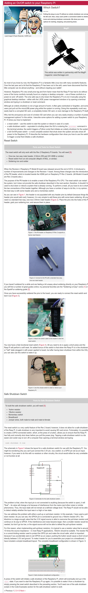
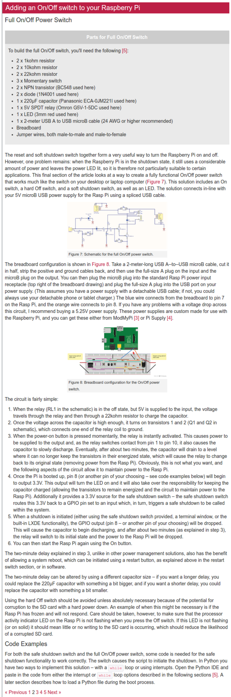
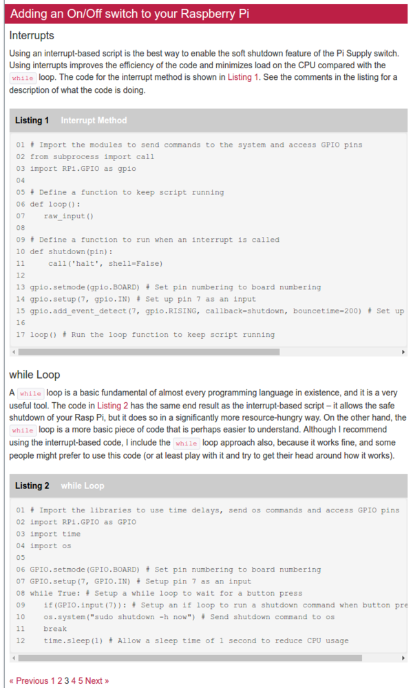

* I was wondering on how to add on - off switch to Raspberry PI.
* The problem with Raspberry PI is that the system will automatically turned on if there is a power connected.
* The other problem is that with Raspberry PI has 2 methods to turn off. The first on is hard - reset (the hardcore method) by plugging off the power cable which is not recommended. The second method is to shutdown via CLI or desktop environment, then plug off the power cable after the system turned off.
* So, I think the ideal case in this scenario is to have 2 switches. The first switches is to shutdown the operating system, while the second switches will be to disconnect battery and the Raspberry PI itself.
* I found the a tutorial here, [http://www.raspberry-pi-geek.com/Archive/2013/01/Adding-an-On-Off-switch-to-your-Raspberry-Pi](http://www.raspberry-pi-geek.com/Archive/2013/01/Adding-an-On-Off-switch-to-your-Raspberry-Pi), but I have not yet test it.
* I just realized that the tutorial is 5 pages. So here are the links.
    * [http://www.raspberry-pi-geek.com/Archive/2013/01/Adding-an-On-Off-switch-to-your-Raspberry-Pi](http://www.raspberry-pi-geek.com/Archive/2013/01/Adding-an-On-Off-switch-to-your-Raspberry-Pi).
    * [http://www.raspberry-pi-geek.com/Archive/2013/01/Adding-an-On-Off-switch-to-your-Raspberry-Pi/(offset)/2](http://www.raspberry-pi-geek.com/Archive/2013/01/Adding-an-On-Off-switch-to-your-Raspberry-Pi/(offset)/2).
    * [http://www.raspberry-pi-geek.com/Archive/2013/01/Adding-an-On-Off-switch-to-your-Raspberry-Pi/(offset)/4](http://www.raspberry-pi-geek.com/Archive/2013/01/Adding-an-On-Off-switch-to-your-Raspberry-Pi/(offset)/4).
    * [http://www.raspberry-pi-geek.com/Archive/2013/01/Adding-an-On-Off-switch-to-your-Raspberry-Pi/(offset)/6](http://www.raspberry-pi-geek.com/Archive/2013/01/Adding-an-On-Off-switch-to-your-Raspberry-Pi/(offset)/6).
    * [http://www.raspberry-pi-geek.com/Archive/2013/01/Adding-an-On-Off-switch-to-your-Raspberry-Pi/(offset)/8](http://www.raspberry-pi-geek.com/Archive/2013/01/Adding-an-On-Off-switch-to-your-Raspberry-Pi/(offset)/8).
* Full screenshot of the tutorial.

