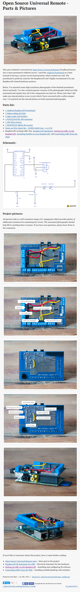

* There is a tutorial on how to interfacing IR transceiver with Raspberry PI, [http://alexba.in/blog/2013/06/08/open-source-universal-remote-parts-and-pictures/](http://alexba.in/blog/2013/06/08/open-source-universal-remote-parts-and-pictures/).
* There a pre - requisite tutorial here on how to setting LIRC in Raspberry PI computer, [http://alexba.in/blog/2013/01/06/setting-up-lirc-on-the-raspberrypi/](http://alexba.in/blog/2013/01/06/setting-up-lirc-on-the-raspberrypi/).
* I think these tutorials might suit my need.
* Here are screenshot from both tutorials.

