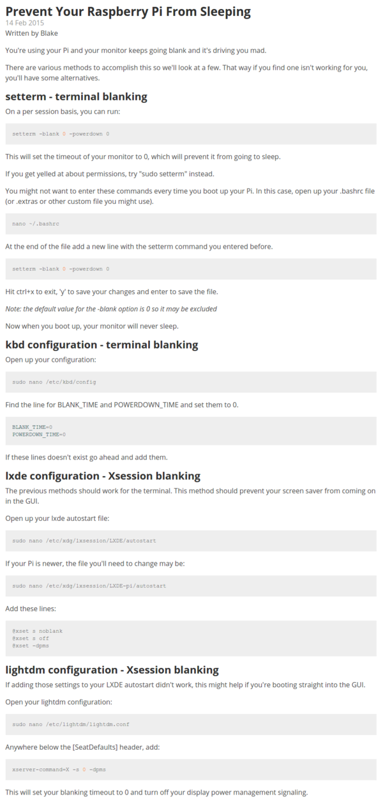

* Preventing Raspberry PI from sleeping or goes to screen saver mode, [https://www.bitpi.co/2015/02/14/prevent-raspberry-pi-from-sleeping/](https://www.bitpi.co/2015/02/14/prevent-raspberry-pi-from-sleeping/).
* Full screenshot.

