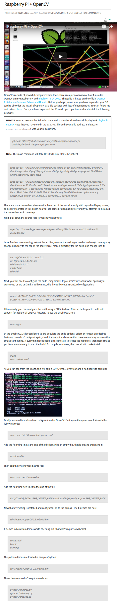

* Raspberry PI and OpenCV tutorial, [http://mitchtech.net/raspberry-pi-opencv/](http://mitchtech.net/raspberry-pi-opencv/).
* This is a tutorial about how to use OpenCV in Raspberry PI. However, I did not use this.
* Full screenshot.

