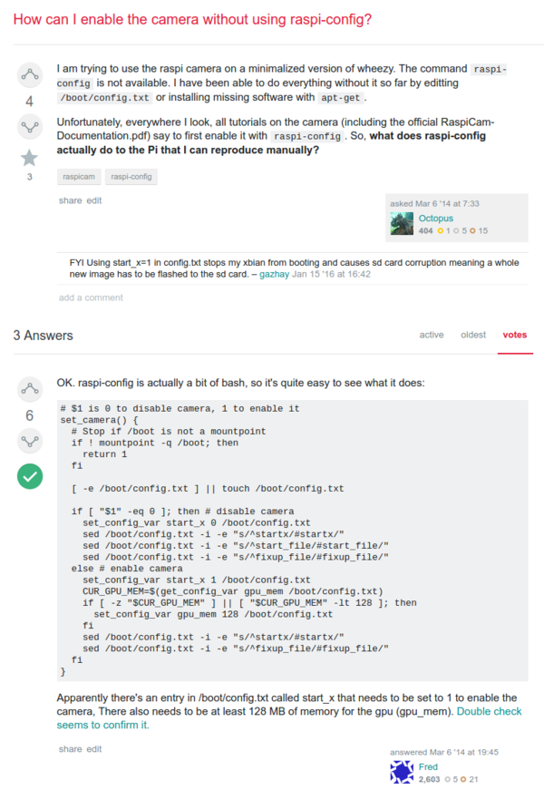

* Here is a tutorial on how to enable Raspberry PI ribbon camera without using `raspi-config`, [http://raspberrypi.stackexchange.com/questions/14229/how-can-i-enable-the-camera-without-using-raspi-config](http://raspberrypi.stackexchange.com/questions/14229/how-can-i-enable-the-camera-without-using-raspi-config).
* Here is the Bash codes to enable camera without using `raspi-config`.

```markdown
# $1 is 0 to disable camera, 1 to enable it
set_camera() {
  # Stop if /boot is not a mountpoint
  if ! mountpoint -q /boot; then
    return 1
  fi

  [ -e /boot/config.txt ] || touch /boot/config.txt

  if [ "$1" -eq 0 ]; then # disable camera
    set_config_var start_x 0 /boot/config.txt
    sed /boot/config.txt -i -e "s/^startx/#startx/"
    sed /boot/config.txt -i -e "s/^start_file/#start_file/"
    sed /boot/config.txt -i -e "s/^fixup_file/#fixup_file/"
  else # enable camera
    set_config_var start_x 1 /boot/config.txt
    CUR_GPU_MEM=$(get_config_var gpu_mem /boot/config.txt)
    if [ -z "$CUR_GPU_MEM" ] || [ "$CUR_GPU_MEM" -lt 128 ]; then
      set_config_var gpu_mem 128 /boot/config.txt
    fi
    sed /boot/config.txt -i -e "s/^startx/#startx/"
    sed /boot/config.txt -i -e "s/^fixup_file/#fixup_file/"
  fi
}
```

* However, there are other thing that you need to do as well.
    * Setting the GPU memory to be at least 128 MB.
    * In `/boot/config.txt` there is `start_x` that needs to be set to `1`.
* Full screenshot.

