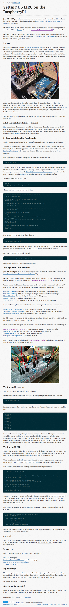
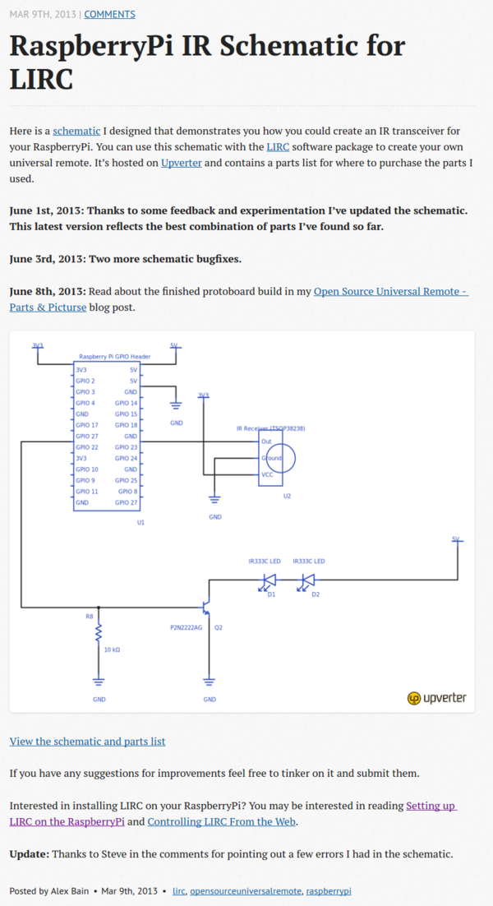

* This a basic LIRC setup for Raspberry PI's Raspbian Jessie that I often refer to during this project.
    * [http://alexba.in/blog/2013/01/06/setting-up-lirc-on-the-raspberrypi/](http://alexba.in/blog/2013/01/06/setting-up-lirc-on-the-raspberrypi/), operating system wise on how to setup LIRC with Raspberry PI's Raspbian.
    * [http://alexba.in/blog/2013/03/09/raspberrypi-ir-schematic-for-lirc/](http://alexba.in/blog/2013/03/09/raspberrypi-ir-schematic-for-lirc/), basic LIRC schematics in Raspberry PI.
* Screenshot of both tutorials.

* Screenshot for the schematics.

