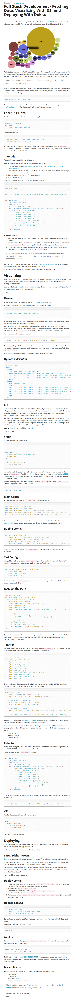

* Full stack web development, with Flask and D3.js, [https://realpython.com/blog/python/web-development-with-flask-fetching-data-with-requests/](https://realpython.com/blog/python/web-development-with-flask-fetching-data-with-requests/).
* Here is the full screenshot.

