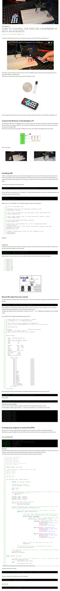

* Controlling Raspberry PI with IR, LIRC tutorial, [http://ozzmaker.com/how-to-control-the-gpio-on-a-raspberry-pi-with-an-ir-remote/](http://ozzmaker.com/how-to-control-the-gpio-on-a-raspberry-pi-with-an-ir-remote/).
* Full screenshot of the article.

