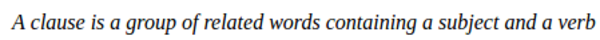

* A clause isa group of related subject and verb.
* So at minimum clause needs to have subject and verb.
* And both need to be related to each other.

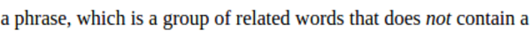

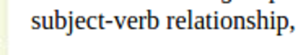

* Whereas phrase is not necessary to have a subject and verb relationship.

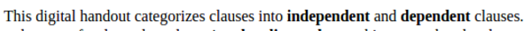

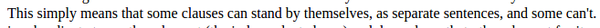

* There are independent and dependent clauses.
* Independent clause can stand on its own.
* Whereas dependent clause need to have another clause.

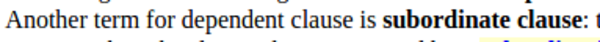

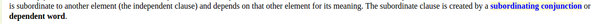

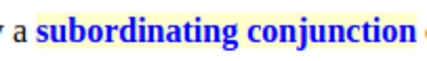

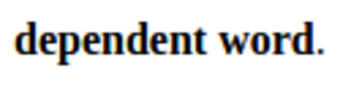

* There is subordinate clause.
* This kind of clause need to have a subordinating conjunction.
* This kind of clause depend on other clause for its meaning.

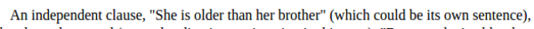

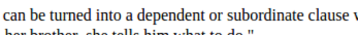

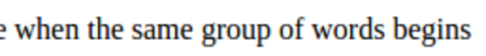

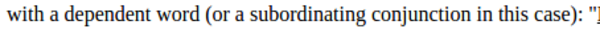

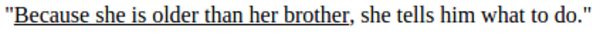

* Multiple clauses can be separated into single sentences if there is an independent clause.
* The trigger here is when there is subjugating conjunction.
* For example in this sentence, "Because, she is older than her brother, she tells him what to do.".
* The subjugating conjunction is "because". With this the sentence then can be separated into smaller sentences based on the independent clause the first sentence has.

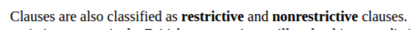

* Clause is also classified as restrictive and non - restrictive.

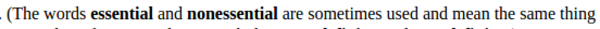

* The word essential and non - essential are also used to label restrictive and non - restrictive clause.
* I personally, found that essential and non - essential are better fit than restrictive and non - restrictive.

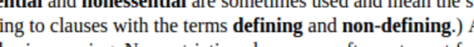

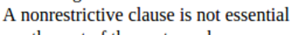

* There is also defining clause and non - defining clause as well which are the same words to label restrictive and non - restrictive clauses.
* As well as to essential and non - essential clause.

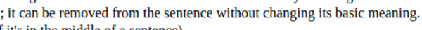

* Non - essential clause can be removed from a sentence it belongs to without changing its meaning.

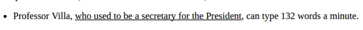

* In this example "who used to be a secretary for the President" is an example of non - restrictive clause.
* In the example of, "Professor Villa, who used to be a secretary for the President, can type 132 words a minute." can be separated into two separate sentence based on each clauses into these sentences.
    * Professor Villa used to be a secretary for the President.
    * Professor Villa can type 132 words a minute.

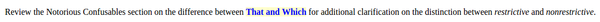
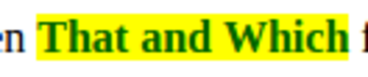

* There are some differences between the usage of word "that" and "which".

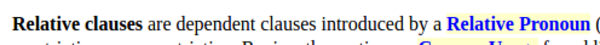

* There is this relative clause which are dependent by a relative pronoun.

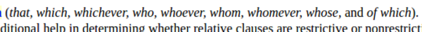

* Some examples of relative pronouns are: that, which, whichever, who, whoever, whom, ....

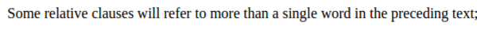

* Some relative clauses will refer to more than single words in the next text.

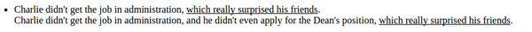

* The sentence above is an example of relative clause that refers to more than one words.
* I think, then, relative clause can be referred back to either clause or phrase or just a word.

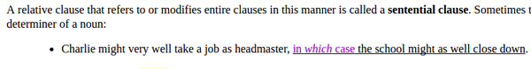

* There is also a sentential clause that modifies the main clauses.
* In above example, "in which case" is what starts the sentential clause.

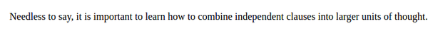

* All in all it is important to combine similar sentence into a larger sentence if those holds nearly the same idea or related to each others.

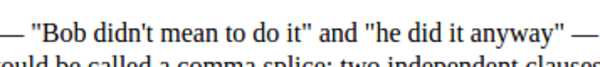

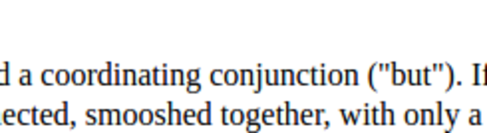

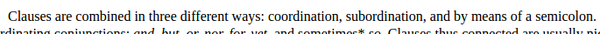

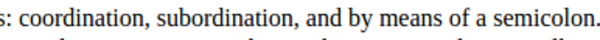

* Clauses can be combines in three different ways.
    * Coordination.
    * Subordination.
    * Semi colon.

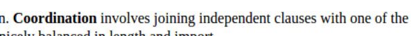

* Coordination involves joining independent clauses with one to each others.

* Example of coordinating words are there.
    * And.
    * But.
    * For.
    * Nor.
    * Or.
    * Sometimes.
    * Yet.

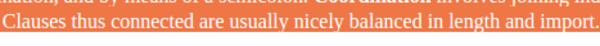

* Need to mention for the best practices is that good sentence contain clauses those are nicely balanced in length.

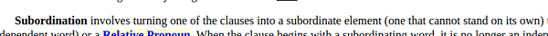

* The next method to combine clause is using subordination.
* This means that there are some clauses that lower than other clause.
* For example these lower clauses are explaining or giving more content to the main clause.

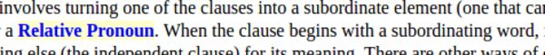

* The lower clause I mentioned in the previous point and then referred as relative clause.
* Relative clause usually starts with relative pronoun. 

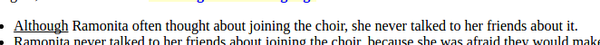

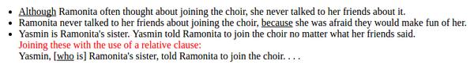

* Some of example sentences on subordination. 

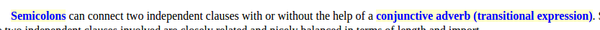

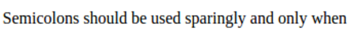

* Semicolons should be used sparingly.

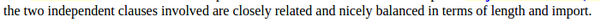

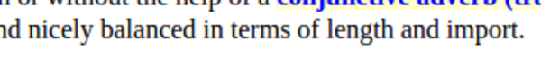

* And as a rule of thumb independent clauses involved need to be closely related and nicely balanced.

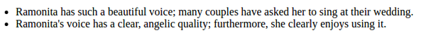

* Above screenshot is some example of sentences showing the usage of semicolons.

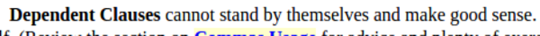

* Dependent clause cannot separated with its main sentence.
* Its context relies on another clause.

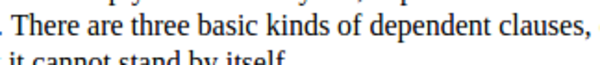

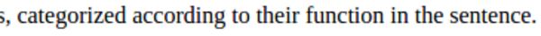

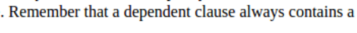

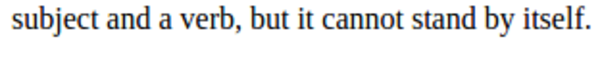

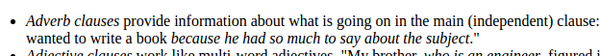

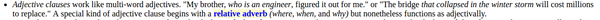

* There are three forms of independent clause.
    * Adverb clause.
    * Adjective clause.
    * Then noun clause.

* Some forms of independent clauses.

* There is this elliptical clause that is not grammatically complete but it is eloquent and simpler to understand.
* The elliptical clause usually known by the reducing some unnecessary words in order to make the sentence clear.

* Some example sentences on elliptical clauses.
* Here is the link to this article, [http://grammar.ccc.commnet.edu/grammar/clauses.htm](http://grammar.ccc.commnet.edu/grammar/clauses.htm).
* Here is the screenshot of the article.

