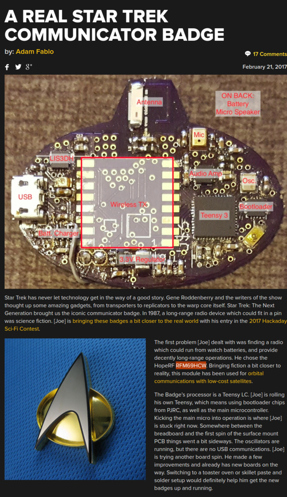

* Star Trek communication badge from Hackaday, [http://hackaday.com/2017/02/21/a-real-star-trek-communicator-badge/](http://hackaday.com/2017/02/21/a-real-star-trek-communicator-badge/).
* There is a radio communication module attached into the badge, but I am not sure on what purpose exactly the radio communication badge serve.
* Full screenshot.

