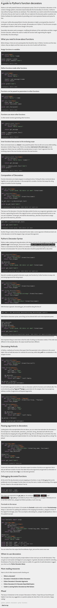

* Tutorial on Python decoration, [http://thecodeship.com/patterns/guide-to-python-function-decorators/](http://thecodeship.com/patterns/guide-to-python-function-decorators/).
* My common mistake when following this tutorial is that I return the function return value instead the returning the function itself.
* This is the mistake.

```markdown
def decorator():
    def wrapper():
        """Doing something."""
        return True
    return wrapper()
```

* Where it is supposed to be like this.

```markdown
def decorator():
    def wrapper():
        """Doing something."""
        return True
    return wrapper
```

* Screenshot.

