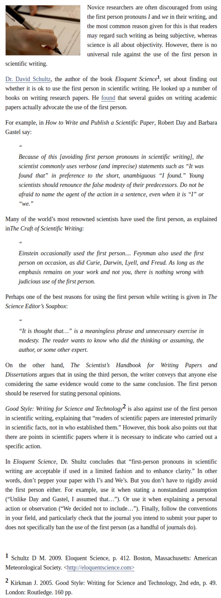

* Article about the usage of first person subject in scientific paper.
* Link to the article, [http://www.editage.com/insights/is-it-acceptable-to-use-first-person-pronouns-in-scientific-writing](http://www.editage.com/insights/is-it-acceptable-to-use-first-person-pronouns-in-scientific-writing).
* The main conclusion is that, yes, you can use first person subject in a scientific paper. But, please make sure to have balance between personal opinion and the facts that the paper is trying to find (as well as other facts referenced from other paper).
* Screenshot.

