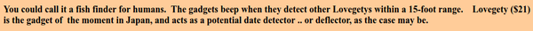
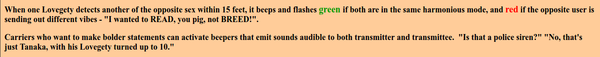
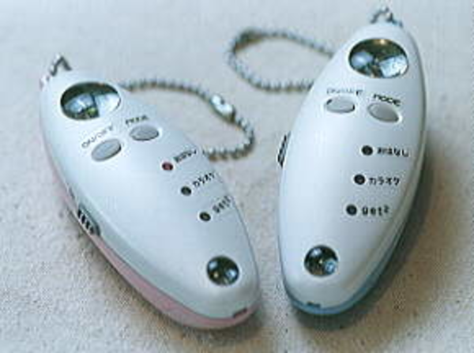
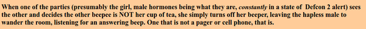
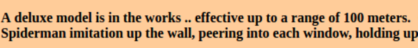
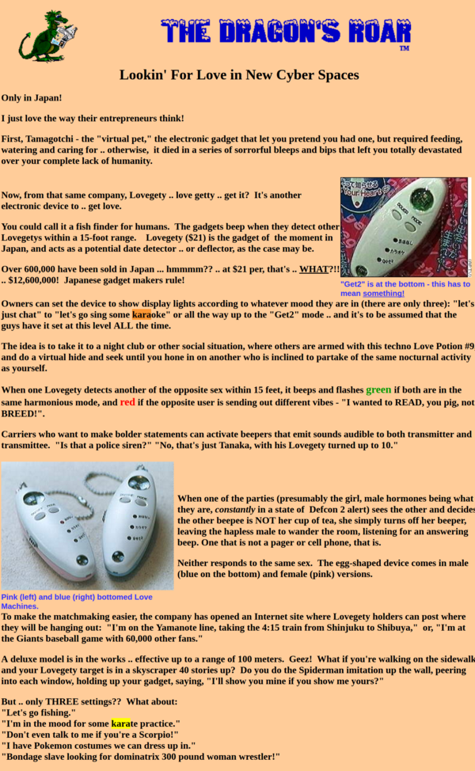
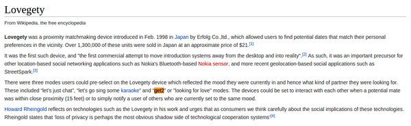

* Lovegety, "physical Tinder" badge.
* There was this electronics badge that was used as a matchmaking tools in Japan.
* There were 3 preferences that you can pick to identify what you want from your potential match. These preferences are these.
	* "Let's just chat.".
	* "Let's go sing some karaoke.".
	* "Get2".
* I think the last one is for sex? I am not sure, if Asian people is into this kind of random "meet and sex" stuffs.
* From the Wikipedia page of Lovegety here, [https://en.wikipedia.org/wiki/Lovegety](https://en.wikipedia.org/wiki/Lovegety), "Get2" mode is inferred as a "looking for love" mode.
* It could means, "looking for girlfriend" as well.
* It works just similar to Tinder, you set your preference, walk, if there is opposite gender that also has the same preference the Lovegety badge will start to notify its wearer.
	* I am thinking on how this badge would notify its wearer. Probably using small vibration motor or beeping sound.
	* But, in densely populated area like Tokyo beeping sound could not be easily heard.
* There is this article from Yahoo as well (I took this article from the Internet way back machine), [http://web.archive.org/web/20091027114257/http://www.geocities.com/Pentagon/Bunker/5921/lovegety.html](http://web.archive.org/web/20091027114257/http://www.geocities.com/Pentagon/Bunker/5921/lovegety.html).

* Looking for love in Japan Cyber Space.

* Electronics device to get love.

* The detection range for this badge is 15 feet so it is around 5 meters (4.572 meters to be exact).
* The badge is priced around 21 US Dollars. Which in my opinion will be quite expensive to buy nowadays, since you can have everything infinitely small and cheaper as a smartphone application anyway.

* This badge had been sold over 600.000 in Japan, so there were potentials.

* So yeah, the main idea is to play "Pokemon GO" but instead of searching for Pokemon you need to search for your love partner.
* This badge is usually used in nightclub or similar spaces.

* So, with this badge the wearer can be more aggressive by turning on feature that let both transmitter and transmittee know to each other by more powerful beeping sound notification.
* This answer to my previous question, several points above. The notification methods are either bleeping sound or LEDs as it is shown in the Lovegety.

* This is the Lovegety badge.

* The way female users to refuse match if the guy is not her cup of tea.

* There are blue bottomed badge for male user.
* There are pink bottomed badge for female user.
* There are nothing for homosexual or transgender badge just yet.

* To make things easier the company made a website to let the users to post a status like where the badge wearer will be around.

* Deluxe model allows you to have range into up to 100 meters.
* But this raises question, if you have the deluxe badge, whereas others only have the normal Lovegety badge. This means that your badge can know other badge in range, but people with normal badge will not get the notification because the range of the deluxe version in further.
* Full article screenshot.

* This is an article about Lovegety from Wikipedia, [https://en.wikipedia.org/wiki/Lovegety](https://en.wikipedia.org/wiki/Lovegety).

* There were actually a concern from western critic about privacy of the user of Lovegety badge.