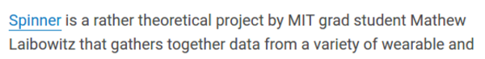
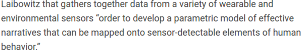
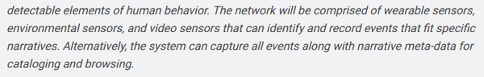
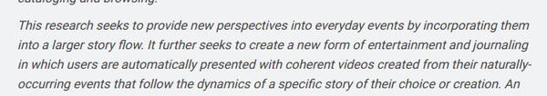
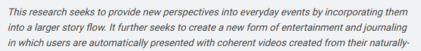
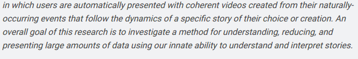
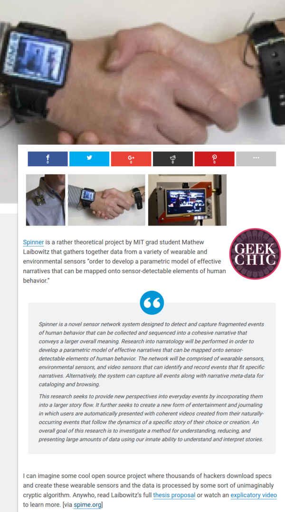

* Spinner is a network for wearable sensors.
* The article is here, [http://makezine.com/2010/04/11/geek-chic-spinner-a-network-of-wear/](http://makezine.com/2010/04/11/geek-chic-spinner-a-network-of-wear/).

* Check Mathew Laibowitz he is an awesome person.

* Spinner is used to gather data from wearable and/or environmental sensors.

* Spinner is a set of sensors network.

* Spinner is a collection of wearable sensors, environment sensors, as well as video.
* These will be used to record and identify specific actions.
* Another cool thing to mention is that every sensors comes into Spinner with each of its meta data to easy cataloging and processing.
	* This is similar to what I want to implement in my mEsch Project.

* Alright, so as whole, this technology is trying to incorporate all possible events happens along someone's life into one coherent story.

* So in more "easy to digest" term, Spinner is used to journal someone life using a set of ubiquitous sensors.
* Here is the screenshot to the article.

[./20170319-1959-cet-geek-chick-spinner-9.mpg](./20170319-1959-cet-geek-chick-spinner-9.mpg)

* There is this video, a promotional video about Spinner. But, honestly, I still do not understand what is the main goal of Spinner as well as why Reyna could/should put the videos into the web sharing platform.