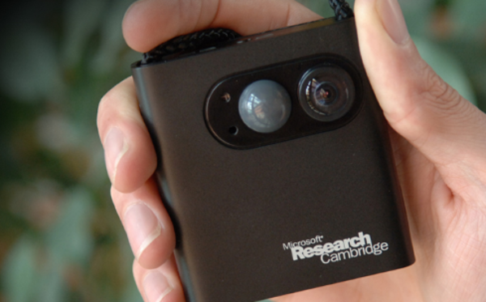
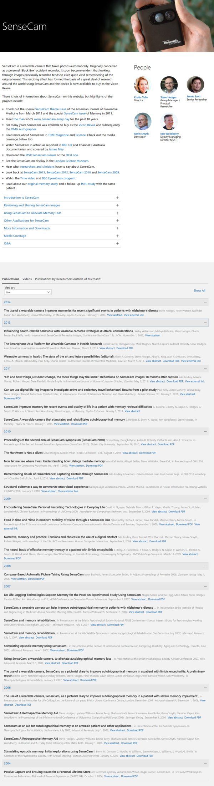

* This is Microsoft SenseCam.

* Wearable device made by Microsoft Research Group back in 2006 (its first paper was released on 2006).
* SenseCam was mentioned as a human blackbox.
* This is the main web page link to the Microsoft SenseCam, [https://www.microsoft.com/en-us/research/project/sensecam/](https://www.microsoft.com/en-us/research/project/sensecam/).
* Here is the full screenshot of SenseCam website.

