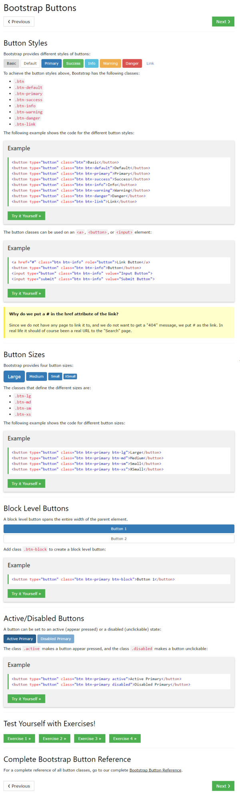

* Bootstrap button classes, [https://www.w3schools.com/bootstrap/bootstrap_buttons.asp](https://www.w3schools.com/bootstrap/bootstrap_buttons.asp).
* Example codes.

```markdown
.btn
.btn-danger
.btn-default
.btn-info
.btn-link
.btn-primary
.btn-success
.btn-warning
```

* Screenshot.

