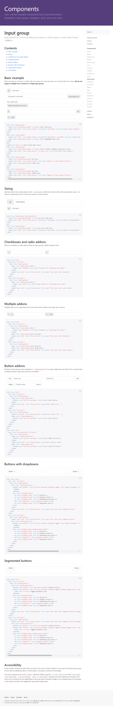

* Example of input grouping in Bootstrap, [https://v4-alpha.getbootstrap.com/components/input-group/](https://v4-alpha.getbootstrap.com/components/input-group/). I think this is only works for buttons and text input though.
* From what I need, I only need these codes.

```markdown
<div class="input-group">
  <span class="input-group-btn">
    <button class="btn btn-secondary" type="button">hate it</button>
  </span>
  <input type="text" class="form-control" placeholder="product name">
  <span class="input-group-btn">
    <button class="btn btn-secondary" type="button">love it</button>
  </span>
  </div>
```

* Screenshot.

