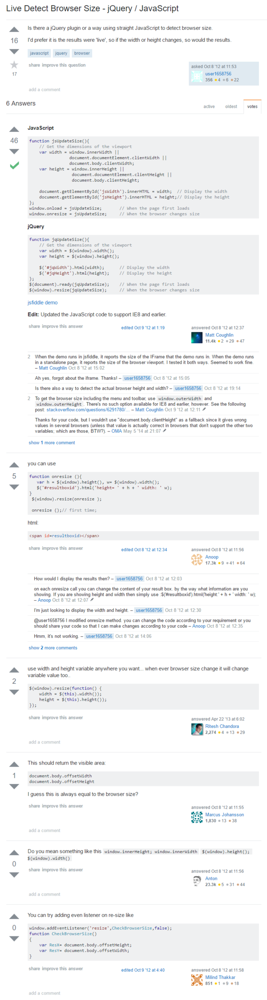

* Live detect browser view port.
* Vanilla JavaScript.

```markdown
function jsUpdateSize(){
    // Get the dimensions of the view port.
    var width = window.innerWidth ||
                document.documentElement.clientWidth ||
                document.body.clientWidth;
    var height = window.innerHeight ||
                 document.documentElement.clientHeight ||
                 document.body.clientHeight;

    document.getElementById("jsWidth").innerHTML = width;   // Display the width.
    document.getElementById("jsHeight").innerHTML = height; // Display the height.
};
window.onload = jsUpdateSize;   // When the page first loads.
window.onresize = jsUpdateSize; // When the browser changes size.
```

* JQuery.

```markdown
function jqUpdateSize(){
    // Get the dimensions of the view port.
    var width = $(window).width();
    var height = $(window).height();

    $("#jqWidth").html(width);   // Display the width.
    $("#jqHeight").html(height); // Display the height.
};
$(document).ready(jqUpdateSize); // When the page first loads.
$(window).resize(jqUpdateSize);  // When the browser changes size.
```

* Link to the StackOverflow discussion, [http://stackoverflow.com/questions/12781205/live-detect-browser-size-jquery-javascript](http://stackoverflow.com/questions/12781205/live-detect-browser-size-jquery-javascript).
* Full screenshot to the StackOverflow discussion.

