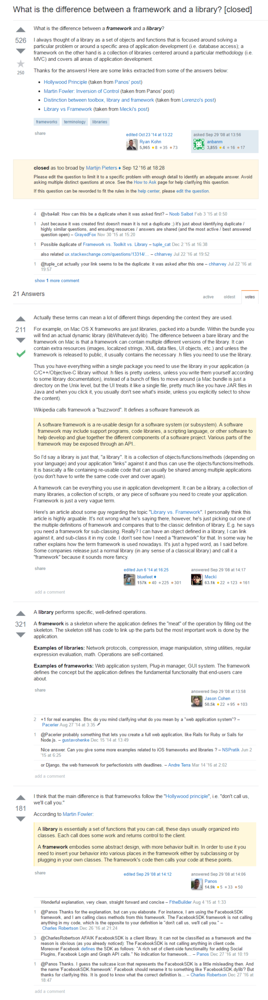
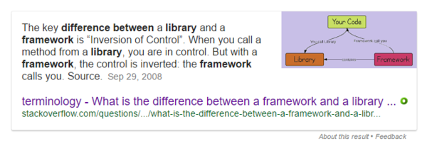

* I was wondering what is the difference between frameworks and programming library.
* In essence.
    * Library is a collection of codes that can be used that usually serve specific purposes.
    * Framework is a collection of codes and binaries for automation, IDE, and tools.
* So, framework itself is a set of development environment. This including the library itself.
* GameMaker Studio and Unity is an example of video game framework.
* Library is like SDL or Phaser.
* Here is another reference from StackOverflow, [http://stackoverflow.com/questions/148747/what-is-the-difference-between-a-framework-and-a-library](http://stackoverflow.com/questions/148747/what-is-the-difference-between-a-framework-and-a-library).
* The screenshot.

* The difference can also be derived by who is controlling whom.
* There are these.
    * Framework.
    * Library.
    * Your codes.
* Your codes calls library.
* Your codes called by framework.