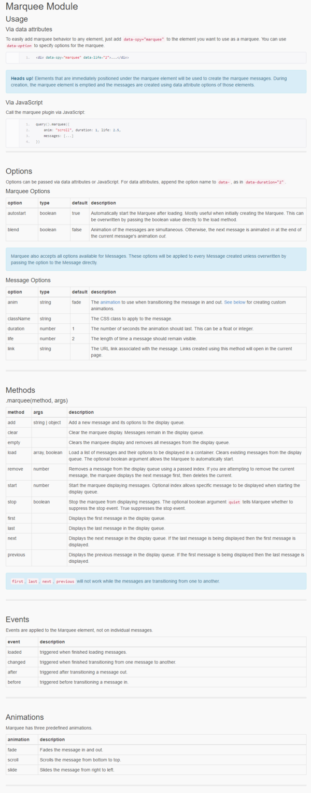

* How to set up interesting marquee text using Bootstrap and Dojo Toolkit, [http://xsokev.github.io/Dojo-Bootstrap/marquee.html](http://xsokev.github.io/Dojo-Bootstrap/marquee.html).
* Link to Dojo Tookit, [http://dojotoolkit.org/](http://dojotoolkit.org/). I think this is an open source project.
* Screenshot.

