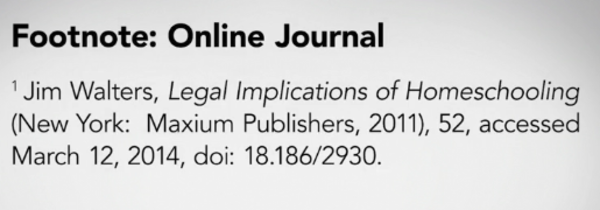

* So again the ImageMagick screwed over my numbering.
* Whatever! Perhaps, I will just make Python script in the future that will help me to convert image more cautiously using ImageMagick.
* For now, here is my summary to the research paper course I took from Lynda.

* There is this citation style guide reference  PDF.
    * [http://www2.isu.edu/success/writing/handouts/comparing_citation.pdf](http://www2.isu.edu/success/writing/handouts/comparing_citation.pdf).
    * [https://owl.english.purdue.edu/media/pdf/20110928111055_949.pdf](https://owl.english.purdue.edu/media/pdf/20110928111055_949.pdf).
* I have download all the PDFs and attach it in this note.

[./20170325-1435-cet-2.pdf](./20170325-1435-cet-2.pdf)

[./20170325-1435-cet-3.pdf](./20170325-1435-cet-3.pdf)

* Specific websites for each citation references.
    * [http://www.apastyle.org/](http://www.apastyle.org/), APA.
    * [http://www.chicagomanualofstyle.org/](http://www.chicagomanualofstyle.org/), CMS.
    * [http://www.press.uchicago.edu/books/turabian/turabian_citationguide.html](http://www.press.uchicago.edu/books/turabian/turabian_citationguide.html), Turabian.
* The MLA website is a dud website.

* It is mandatory to have separate bibliography section in the end of every research paper, despite if there is already a footnotes or in - line citation.

* This point also exists in my previous notes.
* When you are making your bibliography section, you need to arrange the references alphabetically.
* However, when arranging things you do not need to bother the first word if it is a "A", "An", or "The".
    * Basically the article words.
* There are some examples in the screenshot above as well.

* Citation is used to protect the writer from plagiarism charges and inform the reader of the original source.
* So in essence, citation is benefit to both parties: the writer and the reader.

* Some examples.
* Due to the nature of this note that it is not as I what arranged before the image conversion, there are little to no information on which example belong to which styles.

* Please check with your instructor and professor.
* They usually has preferable citation style.

* Some other examples.

* The traditional style of citation, the CMS format uses a lot of Latin abbreviation.
* Check the screenshot above.

* Example of footnotes.
* The line above the footnotes is mandatory.

* Some examples.

* Online website usually has DOI (digital object identifier) to take the reader to the exact source.
* Usually there is a citation style that prefer DOI numbers than the website's URL itself.

* Another example.

* Annotated bibliography is a bibliography with additional words as a summary from the writer.
* The "writer" is the main writer and not the referenced article's writer.

* Choose an easy to read font.
* Or actually just stick from what it is usually used in research paper.

* Normal 1:1:1:1 margin.

* Add additional 0.5 inch ad the side where the paper binder is located.

* Example title page.
* There is a possibility that cover paper is not necessary.
* If not, than disregard this page.

* Example title for non - title page research paper.
* Both are correct.

* Example good title.

* Example of page numbering.

* Another example of page numbering.
* Here "Banks" is the writer last name.
* However, it is not mentioned what if there are more than one writer.

* Use indented paragraph instead of spacing paragraph.

* Use left - align.

* Some general good practices.
    * Always keep bigger picture in mind.
    * Choose interesting topic. This is to make sure your motivation.
    * Follow the rule. Follow the writing process.
* Give yourself enough time to focus on each steps. This means to not cram everything in a day or set of time.