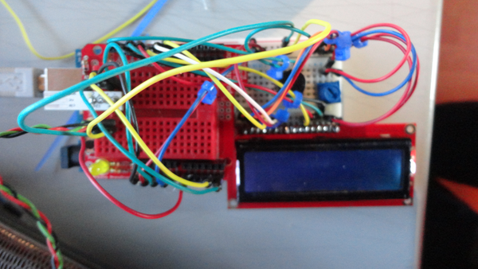

* This is my final end assignment for this Physical Computing course.
* This was an Arduino prototype that listens to incoming emails and then burps a sound as well as displaying the messages tweet long in the 16x2 LCD display.