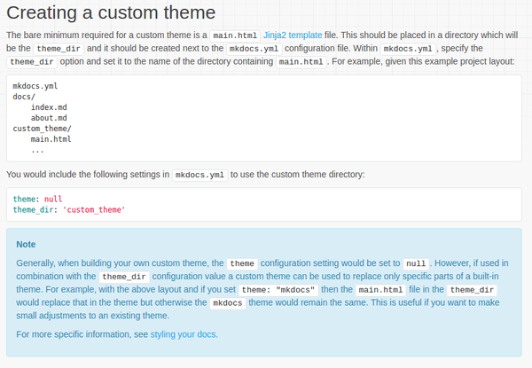
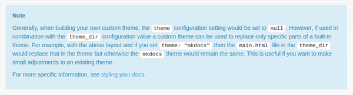

* Create simple mock up.
* Post it into MkDocs forum.
* Search documentations on how to edit MkDocs.
* There is a tutorial in here, [http://www.mkdocs.org/user-guide/custom-themes/](http://www.mkdocs.org/user-guide/custom-themes/).
* I think it is a good starting point to make my own MkDocs theme.
* The MkDocs theme is using HTML Jinja2 Template.
* So basically, there would be a `theme` folder in the level as `mkdocs.yml`.
* All in all MkDocs theme can be just make using one single HTML file, which is nice.
* Here is the basic screenshot to make custom theme.

* Here is a caution from the webpage lol.

