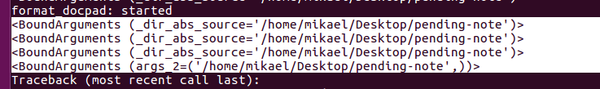

* There is this Python problem if you are trying to make nested decorators that refer variables from the decorated function using string.
* These are the codes.

```markdown
@decorator.check_abs("_dir_abs_source")
def get_dir_up_1(_dir_abs_source:str) -> str:
    directory = remove_separator_last(_dir_abs_source)
    dir_up_1 = directory.replace(
        get_deepest_folder(directory), ""
    )

    return remove_separator_last(dir_up_1)
```

* The codes refer `_dir_abs_source:str` in function `get_dir_up_1()` as `"_dir_abs_source"` in the decorator `@decorator.check_abs()`.
* However this does not work if there are another decorator above decorator `@decorator.check_abs()`.
* Consider this codes.

 ```markdown
@another_decorator("_dir_abs_source")
@decorator.check_abs("_dir_abs_source")
def get_dir_up_1(_dir_abs_source:str) -> str:
    directory = remove_separator_last(_dir_abs_source)
    dir_up_1 = directory.replace(
        get_deepest_folder(directory), ""
    )

    return remove_separator_last(dir_up_1)
```

* In `@decorator.check_abs()` the argument passed into `@another_decorator()` will be `*args_2, **kwargs_2` as it is shown below.



* This is because the decorator takes dynamic arguments.

```markdown
def check_abs(*args_1):
    def decorator(_func:FunctionType):
        sig = inspect.signature(_func)

        def wrapper(*args_2, **kwargs_2):
            bound = sig.bind(*args_2, **kwargs_2)

            for i in args_1:
                val = bound.arguments[i]
                normcase_normpath(val)
                remove_separator_last(val)

                if not is_abs(val):
                    """Raise warning."""
                    exception_and_warning.nap_warning()

                    if sig.return_annotation == bool:
                        return False
                    else:
                        return None

            return _func(*args_2, **kwargs_2)
        return wrapper
    return decorator
```

* So, so far there is no known way to pass the same parameters from a function into multiple parameters with dynamic parameters.
* My current solution is just to make every possible combination of decorator whenever it is neceessary.