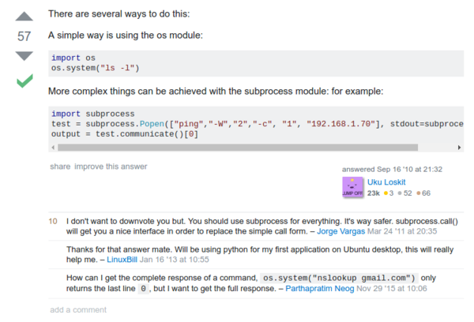

* Here is a StackOverflow discussion on how to execute command to the terminal from a Python codes, [http://stackoverflow.com/questions/3730964/python-script-execute-commands-in-terminal](http://stackoverflow.com/questions/3730964/python-script-execute-commands-in-terminal).
* Here is the discussion.

* As you can see here the people recommend you to use `subprocess` instead of using `os.system()`.