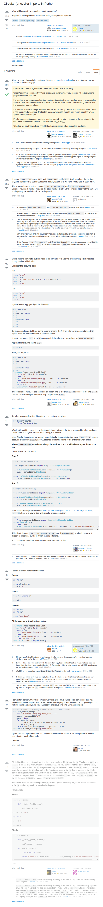

* There is this problem of circular dependency in Python if you are importing a Python file that take reference from the current Python file you are currently editing.
* There is this StackOverflow discussion, [http://stackoverflow.com/questions/744373/circular-or-cyclic-imports-in-python](http://stackoverflow.com/questions/744373/circular-or-cyclic-imports-in-python).
* The problem is, sadly, none. I need to adjust this based on the problem and not on the best possible scenario.
* Here is the full screenshot of the StackOverflow discussion.

