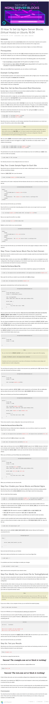

* How to host static website hosting in DigitalOcean, [https://www.digitalocean.com/community/questions/static-website-hosting](https://www.digitalocean.com/community/questions/static-website-hosting).
* In the mentioned link there are 2 available solutions, the traditional LAMP and Nginx.
* However, the poster in the link recommended to use Nginx.
* There are these tutorials I need to follow in order to have static website to be online in DigitalOcean.
    * Initial server setup, [https://www.digitalocean.com/community/tutorials/initial-server-setup-with-ubuntu-16-04](https://www.digitalocean.com/community/tutorials/initial-server-setup-with-ubuntu-16-04).
    * Install Nginx, [https://www.digitalocean.com/community/tutorials/how-to-install-nginx-on-ubuntu-16-04](https://www.digitalocean.com/community/tutorials/how-to-install-nginx-on-ubuntu-16-04).
    * Configure server to serve a website, [https://www.digitalocean.com/community/tutorials/how-to-set-up-nginx-server-blocks-virtual-hosts-on-ubuntu-16-04](https://www.digitalocean.com/community/tutorials/how-to-set-up-nginx-server-blocks-virtual-hosts-on-ubuntu-16-04).
    * Uploading files into DigitalOcean, [https://www.digitalocean.com/community/tutorials/how-to-use-filezilla-to-transfer-and-manage-files-securely-on-your-vps](https://www.digitalocean.com/community/tutorials/how-to-use-filezilla-to-transfer-and-manage-files-securely-on-your-vps).
* Screenshots for the discussion link and for each tutorials.

[./20170706-1352-cet-host-static-website-in-digital-ocean-2.png](./20170706-1352-cet-host-static-website-in-digital-ocean-2.png)

[./20170706-1352-cet-host-static-website-in-digital-ocean-4.png](./20170706-1352-cet-host-static-website-in-digital-ocean-4.png)

[./20170706-1352-cet-host-static-website-in-digital-ocean-6.png](./20170706-1352-cet-host-static-website-in-digital-ocean-6.png)

[./20170706-1352-cet-host-static-website-in-digital-ocean-8.png](./20170706-1352-cet-host-static-website-in-digital-ocean-8.png)

[./20170706-1352-cet-host-static-website-in-digital-ocean-10.png](./20170706-1352-cet-host-static-website-in-digital-ocean-10.png)