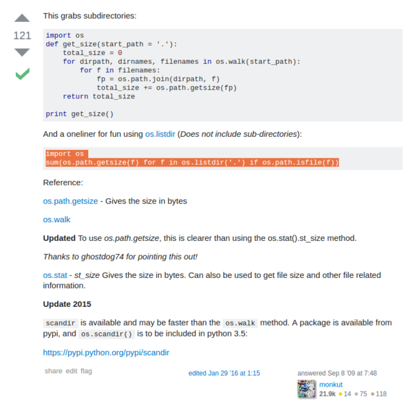

* This is how to get directory size with Python.
* There are 2 methods mentioned here. The first method is to get the directory size with its sub - directories. The other method does not include sub - directories.
* First method.

```
import os
def get_size(start_path = '.'):
    total_size = 0
    for dirpath, dirnames, filenames in os.walk(start_path):
        for f in filenames:
            fp = os.path.join(dirpath, f)
            total_size += os.path.getsize(fp)
    return total_size

print get_size()
```

* Second method.

```
import os
sum(os.path.getsize(f) for f in os.listdir('.') if os.path.isfile(f))
```

* I took this reference from this StackOverflow discussion, [https://stackoverflow.com/questions/1392413/calculating-a-directory-size-using-python](https://stackoverflow.com/questions/1392413/calculating-a-directory-size-using-python).
* Screenshot.



[./20170706-1352-cet-how-to-get-directory-size-with-python-2.png](./20170706-1352-cet-how-to-get-directory-size-with-python-2.png)