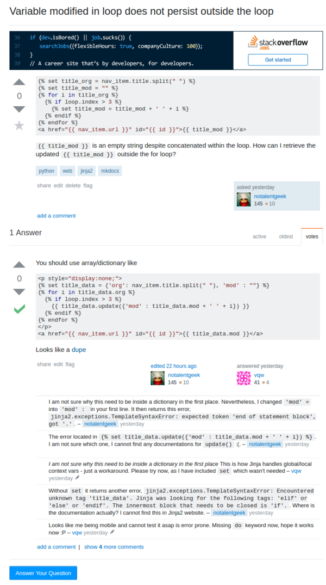

* There is this problem in Jinja2 that variable does not persist outside a for loop.
* The answer is actually to put the variable I want to loop and update into a dictionary.
* Additional problem is that MKDocs does not support `do` extension. Hence, updating dictionary is impossible without using `{{ any_dictionary.update({ ... }) }}` (`{{}}` will prints the Jinja2 variable into DOM).
* The solution is to keep using `{{}}` but encapsulate it into a DOM with `display:none;`.
* This is my example solution from my own StackOverflow thread, [https://stackoverflow.com/questions/44913535/variable-modified-in-loop-does-not-persist-outside-the-loop/](https://stackoverflow.com/questions/44913535/variable-modified-in-loop-does-not-persist-outside-the-loop/).
* Screenshot to my own discussion in StackOverflow.



[./20170706-1352-cet-mkdocs-jinja2-updating-variable-without-do-extension-2.png](./20170706-1352-cet-mkdocs-jinja2-updating-variable-without-do-extension-2.png)

* The codes implementation of my case.

```
<p style="display:none;">


  
    {{ title_data.update({'mod' : title_data.mod + ' ' + i}) }}
  

</p>
<a href="{{ nav_item.url }}" id="{{ id }}">{{ title_data.mod }}</a>
```