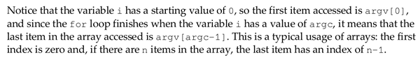

* Starting with C++ this is the first chapter of the book.
* It is stated in this book that C++ offers power and flexibility.
* C++ has the dangerous ability to get closer into computer memory.
* What is "overloading" in C++?
    * Using the same function name with several different parameters sets.
* Here is an example of overloading.

```markdown
#include <iostream>

using namespace std;

class print_data {
    public:
        void print (const char *_c) { cout << "printing character: " << _c << endl; }
        void print (float _f) { cout << "printing float: " << _f << endl; }
        void print (int _i) { cout << "printing interger: " << _i << endl; }
};

int main (int argc, char *argv[]) {
    print_data pd;

    pd.print("hello world"); // Print character.
    pd.print(1); // Print integer.
    pd.print(123.123f); // Print float.

    return 0;
}
```

* In VisualStudio you can define macros as a compiler parameter.
* You can define `#define` by a compiler flags! With VisualStudio the switch is `\D`.
* This book says that using `#define` to define constant is often not a good idea.
* If I think the compiler pre - processor caused an error, try to compile using verbose mode.
* In Windows environment (VisualStudio) there is `\EP` switch (I am not sure on how to use it because I rarely use Windows). For `g++` use the `-v` flag to get into verbose mode!
* `stdout` is a C++ term for command line.
* Macros is not used as mush as nowadays due to `inline`. Moreover because macros do not provide type checking like regular functions does.
* Macros nowadays used as a debugging features. Usually in the compiler there are a way to put custom symbols.
    * In `g++` the parameter is `-g`.
    * This later can be used alongside with `gdb`.
* Some screnshots taken from the book.


[./20170807-1504-cet-1-2.png](./20170807-1504-cet-1-2.png)


[./20170807-1504-cet-1-4.png](./20170807-1504-cet-1-4.png)


[./20170807-1504-cet-1-6.png](./20170807-1504-cet-1-6.png)


[./20170807-1504-cet-1-8.png](./20170807-1504-cet-1-8.png)


[./20170807-1504-cet-1-10.png](./20170807-1504-cet-1-10.png)


[./20170807-1504-cet-1-12.png](./20170807-1504-cet-1-12.png)


[./20170807-1504-cet-1-14.png](./20170807-1504-cet-1-14.png)


[./20170807-1504-cet-1-16.png](./20170807-1504-cet-1-16.png)


[./20170807-1504-cet-1-18.png](./20170807-1504-cet-1-18.png)


[./20170807-1504-cet-1-20.png](./20170807-1504-cet-1-20.png)


[./20170807-1504-cet-1-22.png](./20170807-1504-cet-1-22.png)


[./20170807-1504-cet-1-24.png](./20170807-1504-cet-1-24.png)


[./20170807-1504-cet-1-26.png](./20170807-1504-cet-1-26.png)


[./20170807-1504-cet-1-28.png](./20170807-1504-cet-1-28.png)


[./20170807-1504-cet-1-30.png](./20170807-1504-cet-1-30.png)


[./20170807-1504-cet-1-32.png](./20170807-1504-cet-1-32.png)


[./20170807-1504-cet-1-34.png](./20170807-1504-cet-1-34.png)


[./20170807-1504-cet-1-36.png](./20170807-1504-cet-1-36.png)


[./20170807-1504-cet-1-38.png](./20170807-1504-cet-1-38.png)


[./20170807-1504-cet-1-40.png](./20170807-1504-cet-1-40.png)


[./20170807-1504-cet-1-42.png](./20170807-1504-cet-1-42.png)


[./20170807-1504-cet-1-44.png](./20170807-1504-cet-1-44.png)


[./20170807-1504-cet-1-46.png](./20170807-1504-cet-1-46.png)


[./20170807-1504-cet-1-48.png](./20170807-1504-cet-1-48.png)



[./20170807-1504-cet-1-50.png](./20170807-1504-cet-1-50.png)


[./20170807-1504-cet-1-52.png](./20170807-1504-cet-1-52.png)


[./20170807-1504-cet-1-54.png](./20170807-1504-cet-1-54.png)


[./20170807-1504-cet-1-56.png](./20170807-1504-cet-1-56.png)


[./20170807-1504-cet-1-58.png](./20170807-1504-cet-1-58.png)


[./20170807-1504-cet-1-60.png](./20170807-1504-cet-1-60.png)


[./20170807-1504-cet-1-62.png](./20170807-1504-cet-1-62.png)


[./20170807-1504-cet-1-64.png](./20170807-1504-cet-1-64.png)


[./20170807-1504-cet-1-66.png](./20170807-1504-cet-1-66.png)


[./20170807-1504-cet-1-68.png](./20170807-1504-cet-1-68.png)


[./20170807-1504-cet-1-70.png](./20170807-1504-cet-1-70.png)


[./20170807-1504-cet-1-72.png](./20170807-1504-cet-1-72.png)


[./20170807-1504-cet-1-74.png](./20170807-1504-cet-1-74.png)