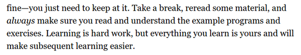

* Human has talent for social and spatial reasonining.
* Computer capable of doing manipulation of meaningless data.

* There is no "state of the art" way to have communication between human and computer.
* At that point communication is specifically made for a purpose from scratch.
* There is no mediator that connnects between human computer.
* Here is the reason why there are 3 kinds of programming language.
	* The high level programming language, that is nearly similar to human language. For example, Java, JavaScript, ....
	* The medium level programming language, that resides in the middle between high level programming language and low level programming language. This kind of programming language capable of doing human - language level of operation as well as machine language level operation (accessing memory, defining memory allocation, ...). The example of this programming language is the C variants, except for C# that is more similar to Java than any other C variants.
	* The low level languages are solely speak machine language. The example of these programming languages are Assembly and Machine Code.
* Here is StackOverflow discussion about "level" in programming language, [http://stackoverflow.com/questions/3468068/low-mid-high-level-language-whats-the-difference](http://stackoverflow.com/questions/3468068/low-mid-high-level-language-whats-the-difference).
* Here is the screenshot.

* Human language is not grammatically strict.
* This means that human can speak with wrong grammar and people will still understand it.
* On the other hand, computer/machine language is grammatically strict.
* However, it says in here that both of human language and computer/machine language follow a same principle.
* I just do not know what is the principle meant in this screenshot.

* Casual computing activity refer to computing activity with graphical user interfaces.
* For example non - casual computing activity will be programming with programming language.
* The hardcore, computing activity will be to programming computer machine directly by allocating its memory blocks manually.
* So, the more user interface available for the human the more casual computing activity it is.

* Usually in more flexible operating system, for example in desktop operating system like, Linux, MacOs, or Windows every users can still do the non - casual computing to hardcore computing if they know what and where to set the environment.
* One example of good non - casual "tool" for computing activity is JavaScript.
* JavaScript is exists in almost every web browser.
* This means that JavaScript is exists in about every consumer device.

* The problem with programming is that the programmer often get lost in their own maze.
* Programmers often feel alienated from the program that they are making.

* Learning is a hard work.

* Computer programmer can built universe with nearly unlimited possible combinations.
* Although, there will still be limitations right and left.
* The screenshot is from Joseph Weizenbaum, from his book titled "Computer Power And Human Reason."
* Here is the link to the book, [http://blogs.evergreen.edu/cpat/files/2013/05/Computer-Power-and-Human-Reason.pdf](http://blogs.evergreen.edu/cpat/files/2013/05/Computer-Power-and-Human-Reason.pdf).
* Here is the .pdf of the book.

[./20170325-1435-cet-introduction-11.pdf](./20170325-1435-cet-introduction-11.pdf)

* There is no proper analogy to compare computer program with any physical real - life things.

* Computer is a machine that capable to host these immaterial machines.
* These immaterial machine refers to simple memory allocation operation of computing activities.

* Computing is used to execute simple task with incredibly high speed.
* However, this simple task can be stacked with other simple task to construct near infinite possible operations.

* Keeping codes under control is a programmer's bane.

* The programming is actually the art of controlling complexity.

* There are a lot way to do stuffs in programming.
* However, as it is mentioned here, programmers tend to stick in a way.
* Sometimes, any programmers who would like to think out side of the box from their codes will be outcast and labeled as a "bad programmer".

* Programming is an ever updated profession.
* One needs to keep exploring and learning on the possible new technology.

* Example of the earliest low level programming languages.

* But then people starting to understand that it could be made more humane.

* And then there is an incentive to name a memory block. This is then what it is now variable.

* `if`, `while`, ... are an example of programming construct.
* These already set as a set of operations in lower level language.

* Every number that you put in a statement will "technically" construct a variable.
* You could see that as `compare` variable in an example from above screeshot.

* Programming language defines a lot of uninteresting details of programming for higher level developer to program.

* Example of the shortest definition of loop in the most concise operation possible.

* To sum up, program can be made in any way possible, from long to short, from unreadable into readable.

* JavaScript has nothing to do with Java.
* Java was first and then JavaScipt came.
* At the time when JavaScript is invented Java was (I think), the most popular programming language.
* Thus, JavaScript developer wants to bandwagon their creation to Java.
* Hence, the name JavaScript.

* JavaScript and ECMAScript is the same.

* JavaScript is very liberal programming language.
* JavaScript has low entry point for beginner.
* However, as your project grows it will getting significantly harder to manage your code.

* The upcoming JavaScript is the ECMAScript 6 JavaScript that will be updated soon enough. There are several web browsers those already apply ECMAScript partially.

* Web browsers is not the only platforms in JavaScript.
* Some database like MongoDB and CouchDB use JavaScript as their programming and query language.

* NodeJS capable of doing system level operation through JavaScript codes.
* Although, NodeJS itself is built with C++ back - end.

* Please consider active learning when learning everything.
* Try to practice the theory.
* This may slow, but you will get easier learning the next similar thing you want to learn.

* Do not assume you are understand before you are doing the solution by yourself.

* As well as do not forget to exercise.

* There is a source code for everything those are listed in this book.

* These are the overview of the book.
* There will be a chapter where I asked to develop myself these things.
	* Artificial life simulator.
	* Dynamic website.
	* Pain program.
	* Platformer video game.
	* Programming language.

* I am wondering what they meant by creating abstract codes?
* It says here that the more abstract your code is, the more control you have over the codes you made.

* There is a chapter about error handling and fixing as well.
* And regular expression.
* Regular expression is the best way to do string manipulation.
* I wanted to learn this, but I saw there is a ton of specifics syntax to selecting and modifying text, hence I cowered up.

* Modularity is another example on writing clean codes.

* Overall structure of the book.