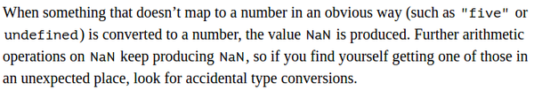

* I was looking for this quotation.
* However, the book seems to be not exists.


* Example of writing 13 with binary number.


* Volatile memory is RAM (Random Access Memory).
* Non - volatile memory is hard disk.
* Modern computer has more than 30 billion bits in volatile data storage. I think this means RAM, right?


* Every set of bits has a role.
* This role is what it is data type in higher level programming language.
* In JavaScript there are these 6 types of basic values.
    * Function.
    * Number.
    * Object.
    * String.
    * Undefined value.
        * Undefined.
        * Null.


* To create value, in JavaScript, you can just invoke its name.


* JavaScript engine usually has its own memory allocation algorithm.
* Nevertheless, the only problem would be if you need __all__ variables to be exists at the same time.
* In case not, variable's memory block will be "rotated" accordingly as it is in the memory allocation algorithm.


* There used to be a problem with accidentally overflowing the value of a variable.
* Especially in 8 bits or 16 bits computer.
* Today computer is at least 32 bits to 64 bits.
* There should be no problem on dealing larger variable's value.


* The positivity of a number (whether it is positive or negative number) as well as decimal point are stored on another block of memory.
* Hence, float and negative float number need more memory blocks.
* The maximum number of decimal points can be stored with JavaScript (this paragraph does mention whether this is meant for computer or JavaScript in general) is 9 quadrillion (15 trailing zeros), which is still good for most program written in JavaScript.


* Here is an example of exponent notation.
* For example, `2.999e8` means `2.999*10^8`.
* For example, `2.999e-8` means `2.999*10^-8`.


* For number with infinite amount of trailing numbers behind comma, like for example pi.
* The ideal case would be an approximation.
* So, programmers need to be careful when dealing with decimal numbers. The best is to make an approximation of those numbers.


* Operators are most of the time is a symbol.
* Mathematics operator like `+`, `-`, ....
* There are these kinds of operator.


* Each operators in any programming language has its own order of magnitude.
* The larger the more priority it has over the lower ones.
* If there are operators with same priority the left will be executed first.
* These all means the basic mathematics equation on which one should be calculated first addition or multiplication.


* So when designing a statement you need to make sure the order of the operators you would like to happen first.
* Then, assign bracket appropriately.
* Actually, just try to put everything in bracket for you to make sure that the operator will happen after the others.


* There is `infinity` and `-infinity` to represent positive and negative infinity.
* Anything happen to `infinity` will still be `infinity`, perhaps the negative or the positive change. There are these examples.
    * `infinity + 1` is still `infinity`.
    * `infinity - 1` is still `infinity`.
    * However, I am still not sure on what will be for `infinity/-infinity`. Will this be `-1`?
* These numbers are not mathematically solid.
* Do not use this, if possible.
* There are little to no use for the programmer to use this, but if this comes from a result of a calculation.


* `NaN` is stand for "not a number".
* `NaN` is used to represent a result that is not meaningful.
* These are an example of operations those will return null.
    * `0/0` will return `NaN`.
    * `Infinity - Infinity` will return `NaN`.
* Any operation that is not meaningful will return as a `NaN` in JavaScript.
    * In other programming language this could be a Math error.
    * This is actually the thing that I do not like from JavaScript.
    * `NaN` does not return error. So, sometimes it is hard to debug a mathematical based animation.


* Newlines is what it is when you press Enter key in your keyboard while typing something.
* String (or text) in JavaScript should be put in a line.
* You cannot put a line break in a string directly by pressing Enter.
* Instead you should use `\n` to imply line break to the JavaScript interpreter.


* Escaping character is a character that will not be included in the quoted text (string).
* In JavaScript or any general programming language (Python included) the escaping character is `\`.


* Above are examples of escaping character to incites line break as well as string operation.
* There is only one operator that can be used to do string operator which is `+`.
* `+` if there are at least one parameter is a string. Then type coercion will happen. This, will make the whole operation to be string concatenation.


* Unary operation is an operation that take one parameter.
* Usually unary operation takes the right side of th operator to be its parameter.
* Whereas binary operation takes what it is in the left and the right of the operator.
    * For example, `1 + 2` is a binary operator.
    * That operation will take `1` and `2` as its parameter.
* An example of unary operation is `typeof` which to return a string of the parameter's type data.
* Another example of unary operation is `-` and `!`. These are use to inverse numbers and boolean respectively.


* Here are another example of binary operator.
* This time this is a operator for comparison.
* Comparison operator will return a boolean value (whether it is `true` or `false`).


* From the above paragraph, I know that string can also be compared.
* Every character has its own Unicode and string comparison will compare between these Unicode.
* Good thing to mention is that lower case is larger than upper case.
* For example, `a > Z` will return `true`.
* The Unicode standard applied to any symbol you see in your computer.
* These includes Arabic, Chinese, Cyrillic, Japanese, ....
* When comparing string, JavaScript goes from the left to right and go step - by - step in increasing index.


* `NaN == Nan` will be false, although both value is the same.
* `NaN` is the only value in JavaScript that will return `false` when compared to itself.


* `NaN`, in JavaScript, is used to determine the result of nonsensical computation.
* And as such it does not equal to other nonsensical results.


* Unary operation `!` or not, is used to flip the value of boolean.
* For example, `!false` will be `true`.


* Knowing all the operation.
* The most important thing when programmer tries to make a statement is to take care which one is more operators has more priority then the other.
* For example this below is a valid JavaScript operation.

```markdown
1 + 1 == 2 && 10 * 10 > 50
```

* The programmer needs to define which operators will happen first.
* Otherwise, to make sure and for safety you can also bind the operators and the parameters in a brackets of `()`.


* So, based on above paragraph.
* Mathematical operations will happen first.
    * So these means all of those, `%`, `*`, `+`, `-`, `/`.
        * But each has its own priority that otherwise will be taken from left to right.
        * For example `*` will happen first, then `-`.
    * The next priority is those comparison operator: `>`, `<`, `>=`, `<=`, `==`, `!=`, `===`, `!==`.
    * Then "and" operation `&&`.
    * Then "or" operation `||`.


* There is only one ternary operation in JavaScript which is used for conditional value assignment.
* Ternary operation is operation that takes 3 parameters.
* These are the examples.

```markdown
console.log(true ? "hello" : "world") // Will print "hello" in the console.
console.log(false ? "hello" : "world") // Will print "world" in the console.
```


* The previous point is a conditional operation.
* The value on the left of the question mark will assign a boolean comparison.
* The value on the left of ":" will be assigned if the boolean comparison is `true`.
* The value on the right of ":" will be assigned if the boolean comparison is `false`.


* Many operation in JavaScript do not produce meaningful value.
* In JavaScript this will be shown as `null` or `undefined`.


* `null` and `undefined` are an accident during the JavaScript development.
* __In most of the time these values do not matter.__
* But for me, I define `undefined` as if I have a variable but I have not yet to put a value in it.
* `null` will be used to define an "empty" variable that used to have value.


* I you have concern on the operator's priority, then it is the best solution to have each operations within a bracket. Thus, you can assign the priority properly.


* Example of automatic type conversion in JavaScript.
* This is what it means to be programming/scripting language with type coercion.


* When something does not mapped properly to a number or a boolean in an obvious way, a `NaN` will be the result.
* For example, `"five" - "four"` will be `NaN` (I think, I have not yet try this, in any cases I hope you get my point).



* So overall, in case JavaScript programmer find a `NaN` bug, they need to see on potential type coercion.
* Usually `NaN` happen because of division by 0 or unwanted type coercion.


* Type coercion exists when comparing values.
* Example of valid type coercion within comparison operator.
    * `"" == false` will return `true`.
    * `0 == false` will return `true`.
    * `NaN == false` will return `true`.
    * `null == 0` will return `true`.
    * `null == undefined` will return `true`.
* You can use comparison to know if your data is valid.
* For example, you can use `"" == false` to check the validity of string.


* In order to prevent type coercion when comparing value, in JavaScript you can use `===` or `!==`.
* Both operators are binary operator.
* Both operators mean as a strict comparison operator.


* It is recommended in JavaScript to have all comparison to be in strict comparison.
* So you are sure that both type and the value are the same (or not).


* Be careful, in JavaScript there are comparison operator that can act as a value validator.
* These operators are `||` and `&&`.
* The `||` is used to take the left parameter if the left parameter is valid and take the right parameter if the left parameter is invalid.
* I would call the `||` as a left valid checker.


* This technique is called "short - circuiting logical operator".


* The `&&` is a left invalid checker.
* The `&&` will check left parameter is invalid then return that value.
* For both `||` and `&&` will try to return the left value if the left value satisfy the condition.


* If the condition is satisfied already, then there will be no check on the right parameter.


* The conditional operator (the only ternary operation JavaScript has) works in similar way.
* The first value is checked if it it true than the operation end without checking another value.


* Value in JavaScript is inferred by typing its name directly.
* For example, `true`, `null` or the arbitrary values, like `13` or `"abc"`.
* You can combine or transform value with operator.
* Learning what operators are available is a crucial part when learning a programming/scripting language.


* The conclusion for this chapter.