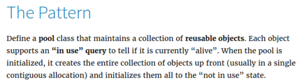

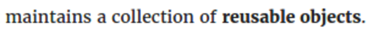

* Object pooling in programming is a technique to re - use object instead of re - initiating new ones.

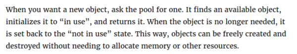

* So, polling means that you do not create new object, but you look into which object is available to be use inside a list.
* The way object is controlled (added back, remove, edit) is by using flags. For this example, this chapter uses `bool inUse_` to determine if there is operation that affects the object or not.

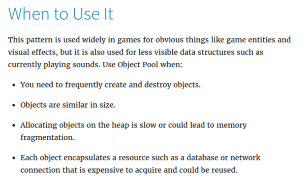

* When to use pooling.
	* You need many similar object that frequently created and destroyed. For example, bullet or particle.
	* The objects are similar in size.
	* Allocating dynamic memory is always slower than allocating fixed memory.
	* Encapsulate persistent stream. For example database connection or networking. Imagine, for every time you initiated the object it takes time to establish this connection. So better initiate all connections in the beginning (caching).

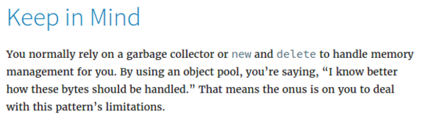

* Usually programming language has garbage collector.
* By using pooling, it means you are making your own garbage collector.

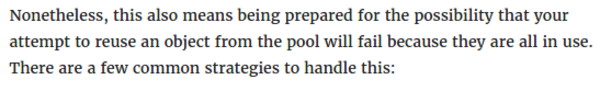

* The pool object should be able to manage all objects that it is in the pool.
* For example if the app/game wants to activate an object but there are no object that can be used, this, should returns null.

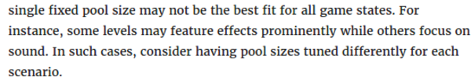

* Single sized pool is bad.
* Multiple sized pool for each needs are better.

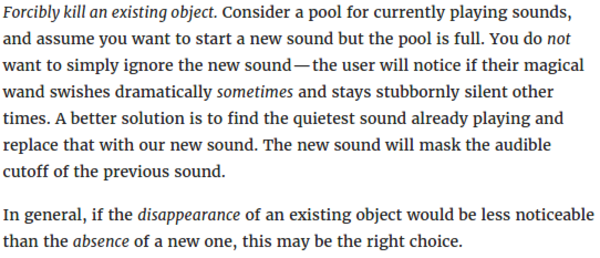

* If you want to activate an object in a pool but there are none that can be used. Then, try to find the most "useless" object to be turn off so that it can be used for an object that is more important. Check the sound example above.

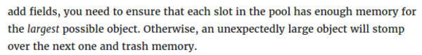

* In heterogeneous pool, make sure each slot is the same size.
* And make sure the size of the slot is the largest possible object that the pool can hold.

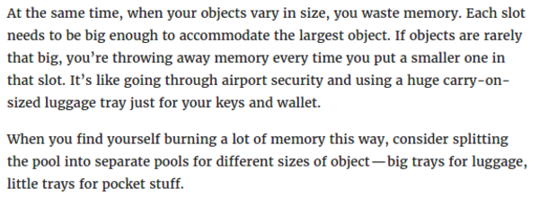

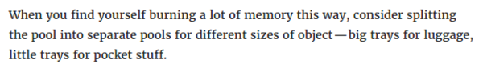

* Always re - factor the pool in case it can be dumbed down into smaller classifications. 

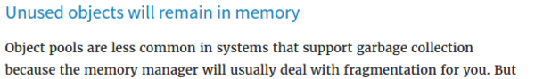
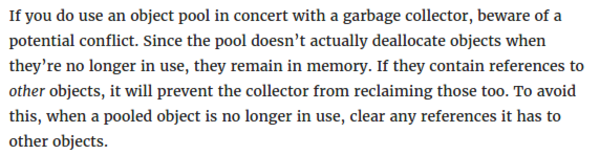

* Be careful if you are using pool with native garbage collector from the programming language (for example for any programming language that is not C variant).
* There could be potential conflict between garbage collector and your self - made pool. Especially when objects in the pool has reference to other object that can be collected by the garbage collector.

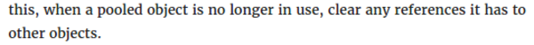

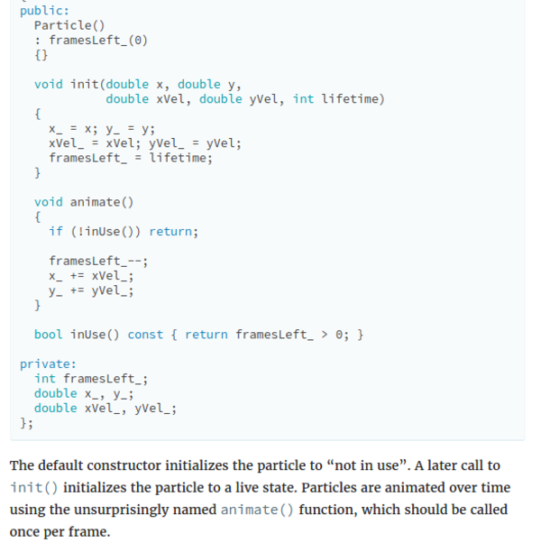

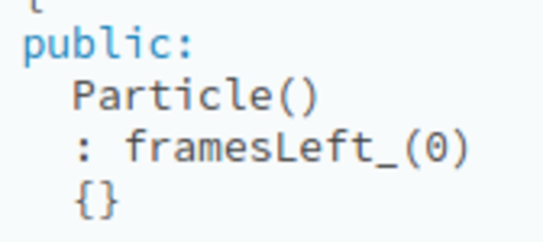

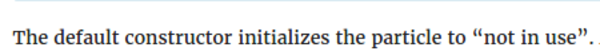

* Always initiate the objects with "inactive" flag set false.
* In most case you want the object to have no constructor.
* An then there would be additional `init()` function to re - init the object if being used again after it is not being used.

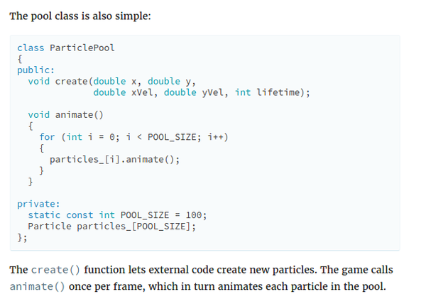

* Example of pool class.

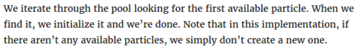

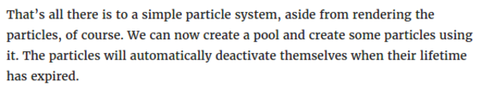

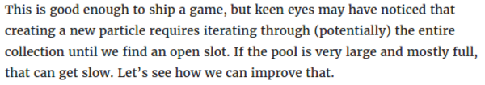

* There is a problem if a pool need to be bigger. Iterate it will cost processing speed.

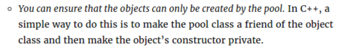

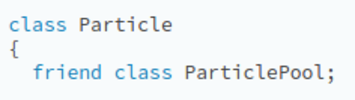

* There is this `friend` function in C++. I do not know on what it is.
* `friend` is a statement for classes or methods, so that only tagged `friend` can borrow functionality of that corresponding `class` or `function`.
* The main C++ documentation is here, [http://www.cplusplus.com/doc/tutorial/inheritance/](http://www.cplusplus.com/doc/tutorial/inheritance/).
* In a nut shell, `friend` is used to access `class` or `function` from other class.

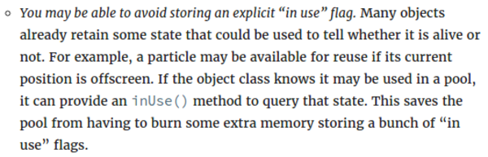

* The best practice is not to use flags but to return a boolean based on values from other variables.
* But, in my opinion it is always the best/fastest to create flags first, then later determine which flags can be deleted (seemed to be unnecessary).

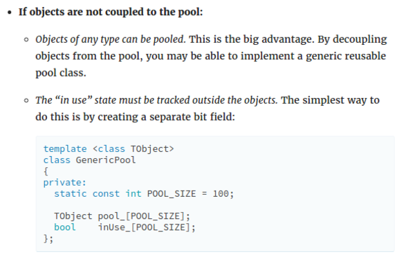

* Object coupling means, whether or not the object and its pool know each others.

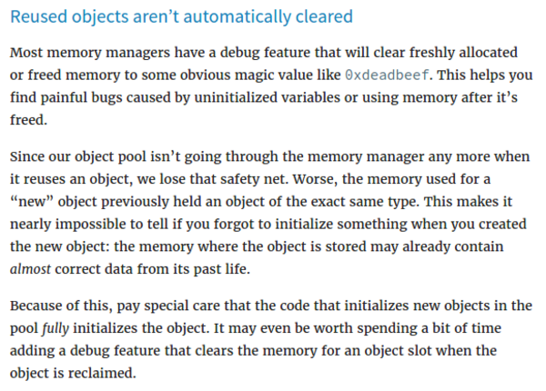

* Adding "safety net" into our self - made pool class.
* Adding debug features into the self - made pool class to make it easy to know general information of objects inside the pool.

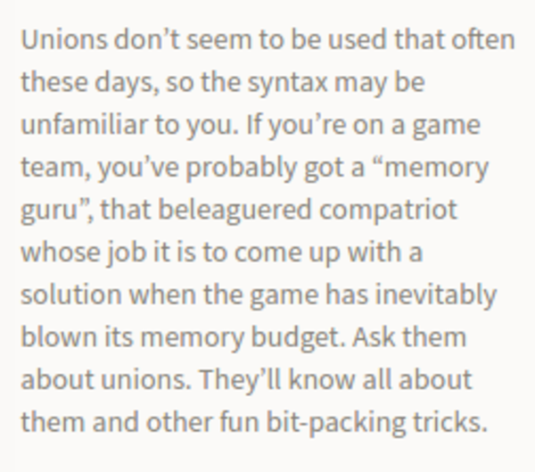

* What is `union` in C++?
* Based on this web page, [http://www.mycplus.com/tutorials/c-programming-tutorials/unions-structures/](http://www.mycplus.com/tutorials/c-programming-tutorials/unions-structures/).
	* A union is a user defined variable which may hold members of different sizes and type. Union uses a single memory location to hold more than one variable. We can use the unions in the following locations.
	* Example of `union`.

```markdown
union myUnion{
	int var1;
	long var2;
};
```

* I think this is more like an answer for statically typed programming language like C to more "dynamically" typed programming language.
* When do you need to use `union`? In the web page, it says, "We don’t know what type of data is to be passed to a function, and you pass union which contains all the possible data types.".
* Here is the full screenshot of the web page.

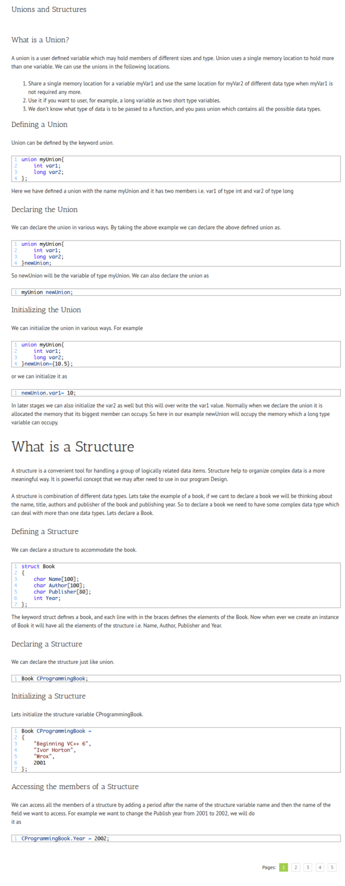

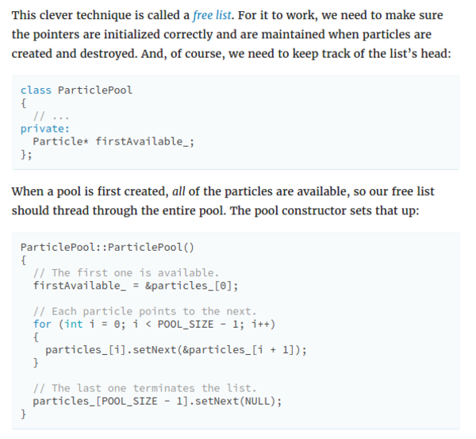

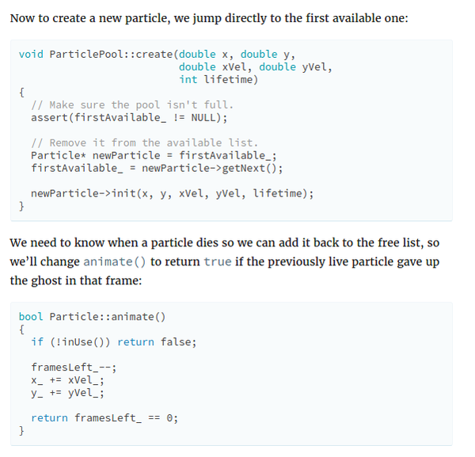

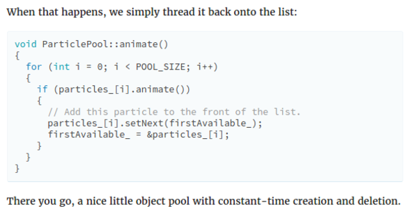

* There is a technique called free list that makes you to utilize objects in the pool that is not active.
* The key here is hold reference to the next important object reference, chained through object in the loop.
* For example in current active object you want to modify, you put a reference into the next available object that can be activated (initiated) and reference to the next object that is not active.

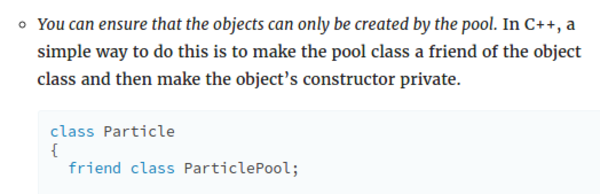

* You can make sure that object can only be created in its corresponding pool by `friend` - ing the object and the pool class.

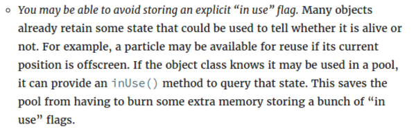

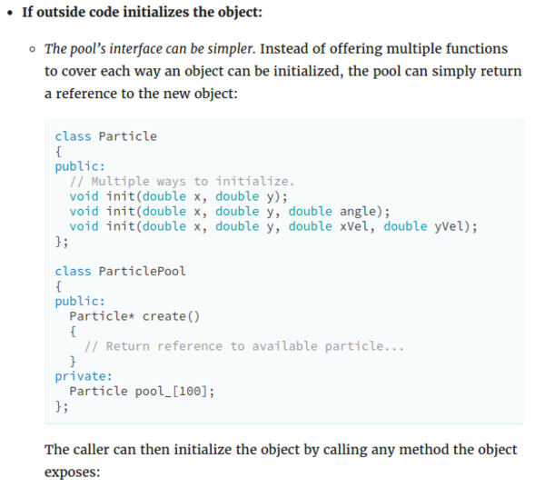

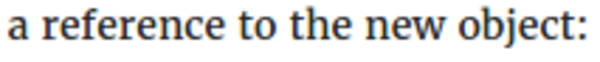

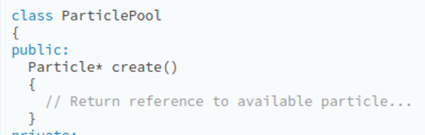

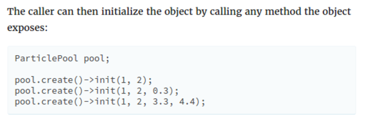

* Example of codes if you want to initialize the object outside the pool.
* The most important things is to keep the reference into every new objects.

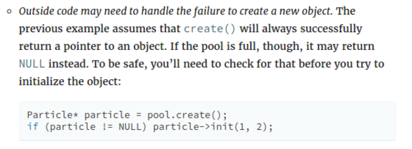

* As it was mentioned before, do not forget to create a "fail - safe". What will happen if the program tries to create/init new object where there no memory slot/available objects to be recycled?
* The example codes above is one example of "fail - safe" if all object in the pool is currently active.

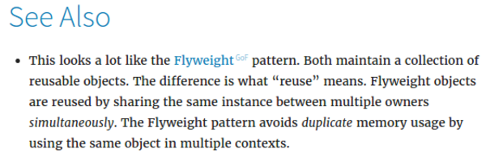

* There is also a technique called "fly weight" to maintain object that shares same resources (for example fonts, meshes, point to CSV, connection queue, ...).

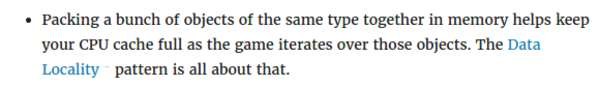

* Make sure to use CPU cache to its maximum capability.
* Here are some notes that I took in my note book.

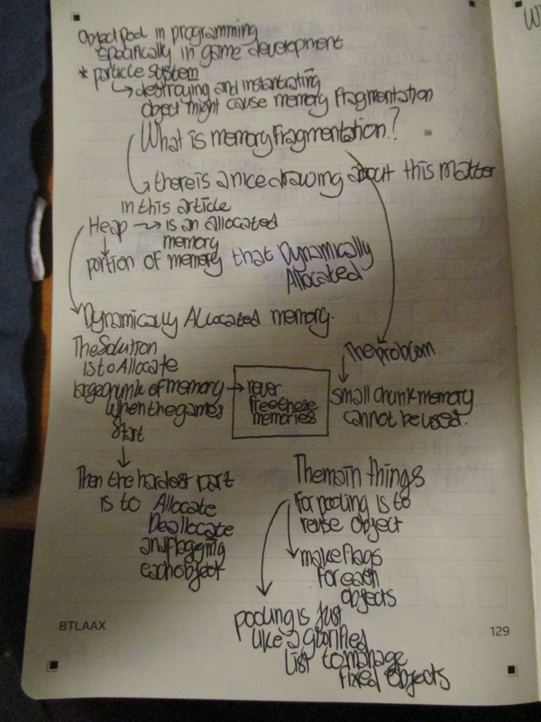

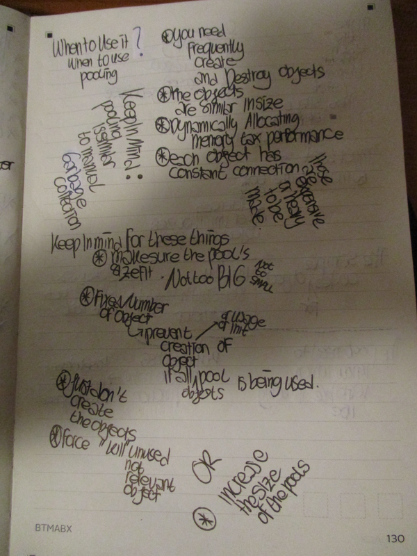

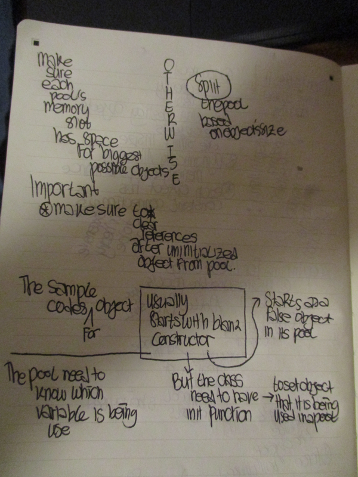

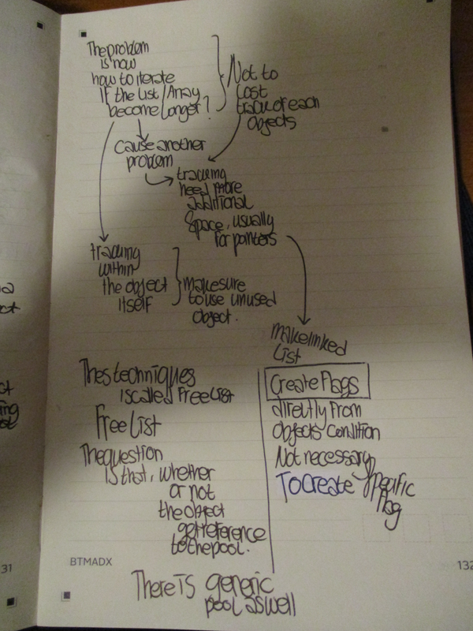