* Now I need to read the preface and then look for any important concepts there.
* Basically the book is about Boost.
* The author have been using Boost since a decade ago.
* The 1st chapter is about building, getting started, and using Boost. I think the first chapter is more about to setup development environment to get started to develop with Boost.
* The 2nd chapter is about basic operation with Boost, I think. It says it deal with data types and handling command line arguments. The latter one seems similar to what I have done with [Docopt](http://docopt.org/).
* The 3rd chapter teaches on how to make "safety net" for the C++ codes. There is also this "smart pointer" stuffs (I am not sure what is that exactly).
* Chapter 4 is about working with strings!
    * There is Boost Range library for elegantly defining subsequences.
    * The Boost Tokenizer library to split strings into tokens using different strategies.
    * There is Boost RegEx as well for text manipulation with Regular Expression.
* The chapter 5 is about "Effective Data Structures Beyond STL".
    * What is STL? Based from Google STL stands for Standard Template Library.
    * This chapter focuses on Boost features that is not in C++ standard library.
* The 6th chapter is about "Bitmap And Multi - Indexing Containers". Looking through bidirectional maps and multi - index containers. These are 2 nifty containers available from Boost.
* Chapter 7 is about "Higher Order And Compile - Time Programming". There are 2 Boost features used in this chapter: Boost Type Traits and Template Metaprogramming libraries. And then there is "Using Boost To Build Simple Parsers Using Spirit Qi DSEL".
* Chapter 8 teaches about using Boost's date and time libraries: Boost Date And Time and Boost Chrono libraries to represents dates, time points, intervals, and periods.
* Chapter 9 deal with directories, files, and general file stream. I think I can port my Python automation program into C++ after I done with this chapter.
* The 10th chapter deal with concurrency with Boost Thread Library and Boost Coroutine library to handle the concurrency logics. There are various synchronization methods also shown here.
* Chapter 11 will deal with networked programming.
* After the the 11th chapter there will be Appendix, for C++ general semantics and Boost emulation of several C++ 11 features in C++ 03.
* What I need to learn from this book is a computer that is able to be installed with C++ and Boost. The detail of installations will be in the 1st chapter.
* There is also CMake. I am not sure what CMake is. I heard this a lot but never really use it.
    * Perhaps, the only time I ever installed CMake is when I compiled OpenCV. I think CMake is like a build tool.
* This book is not repeating what are there in the Boost manual. So, the manual should be read alongside with this book.
* Starting Chapter 1.
* Boost started as a way so that C++ can compete with Java in high - performance embedded software development.
* I think Boost is what JQuery is to JavaScript.
* In C++ there is debug library and non - debug library (do C++ developers call non - debug library as a runtime library?).
    * In my view non - debug library is like JavaScript's .min.js library.
    * The release library is the one in JavaScript that is without the ".min" in the file name.
* There are 3 library naming convention.
    * Versioned Layout, too complicated (beside the library name, mention toolset and version number).
    * System Layout, too minimalistic (beside the library name, this layout only mention version number).
    * Tagged Layout, in the middle of Versioned Layout and System Layout.
* Installing Boost binary in Ubuntu is usually using `apt-get` from terminal `sudo apt-get install libboost-all-dev`.
* Downloading Boost source codes from [http://www.boost.org or http://
sourceforge.net/projects/boost](http://www.boost.org or http://
sourceforge.net/projects/boost).
* There are these additional packages as well to complement Boost libraries (when the library is present).
    * ZLib library.
        * `sudo apt-get install zlib1g`.
        * `sudo apt-get install zlib1g-dev`.
        * `sudo apt-get install zlib1c`.
    * BZip2 library.
        * `sudo apt-get install libbz2` replaced with newer package at `sudo apt-get install bzip2`.
        * `sudo apt-get install libbz2-dev`.
    * ICU library.
        * `sudo apt-get install libicu-dev`.
    * Expat library.
        * `sudo apt-get install libexpat1`.
        * `sudo apt-get install libexpat1-dev`.
* Both "...zip" library is used compression.
* The ICU library is used for Unicode.
* The Expat library is used for XML parsing (the project itself is called Expat XML Parser).
    * Here is what stated in the Expat Library website, "Expat excels with files too large to fit RAM, and where performance and flexibility are crucial.".
* Additionally I can install Clang in Ubuntu with `sudo apt-get install clang`.
* C++, Boost can be used in in Unix platform with both GCC (GNU Compiler Collection) and Clang.
* For Boost Linux install from source codes, CLI for `--prefix=...` refers to the location where the Boost library will be installed. In most cases, Boost library should be installed in non - super user directories.
* There is a step - by - step tutorial as well in this book to build Boost in Windows (perhaps, I need this later when developing codes in Windows platform).
* Screen shot taken for this reading.

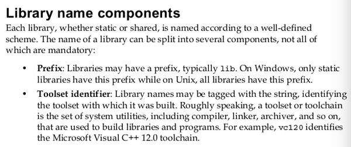

[./20170807-1503-cet-1-2.png](./20170807-1503-cet-1-2.png)

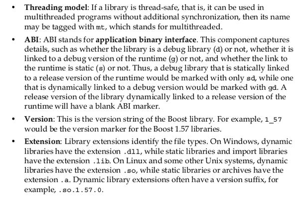

[./20170807-1503-cet-1-4.png](./20170807-1503-cet-1-4.png)

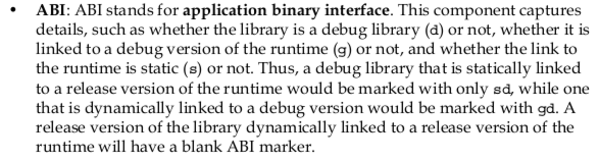

[./20170807-1503-cet-1-6.png](./20170807-1503-cet-1-6.png)

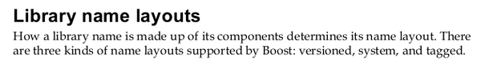

[./20170807-1503-cet-1-8.png](./20170807-1503-cet-1-8.png)

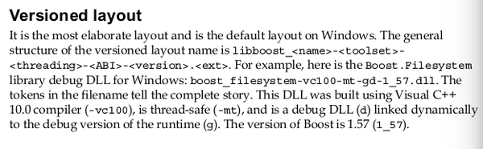

[./20170807-1503-cet-1-10.png](./20170807-1503-cet-1-10.png)

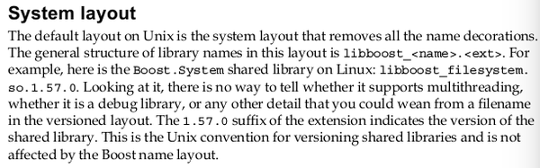

[./20170807-1503-cet-1-12.png](./20170807-1503-cet-1-12.png)

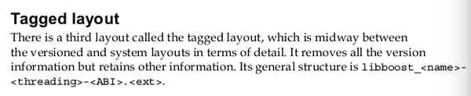

[./20170807-1503-cet-1-14.png](./20170807-1503-cet-1-14.png)

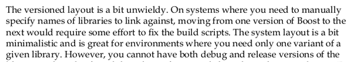

[./20170807-1503-cet-1-16.png](./20170807-1503-cet-1-16.png)

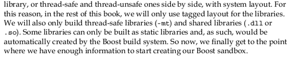

[./20170807-1503-cet-1-18.png](./20170807-1503-cet-1-18.png)

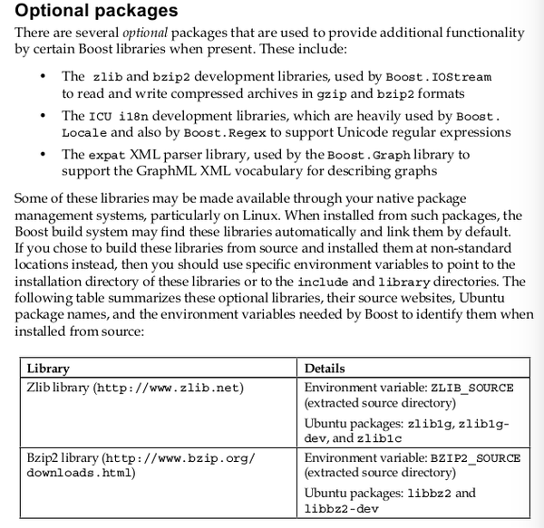

[./20170807-1503-cet-1-20.png](./20170807-1503-cet-1-20.png)

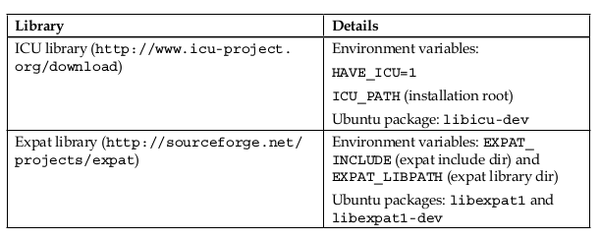

[./20170807-1503-cet-1-22.png](./20170807-1503-cet-1-22.png)

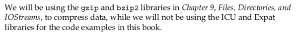

[./20170807-1503-cet-1-24.png](./20170807-1503-cet-1-24.png)

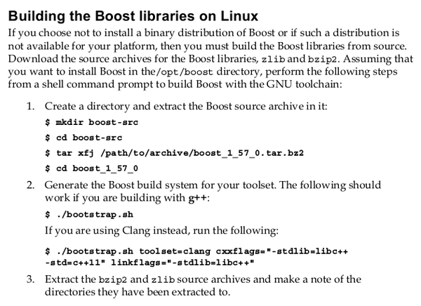

[./20170807-1503-cet-1-26.png](./20170807-1503-cet-1-26.png)

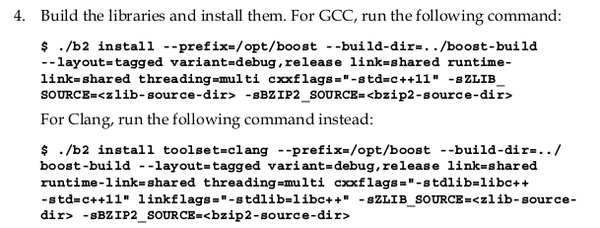

[./20170807-1503-cet-1-28.png](./20170807-1503-cet-1-28.png)

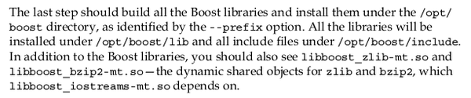

[./20170807-1503-cet-1-30.png](./20170807-1503-cet-1-30.png)

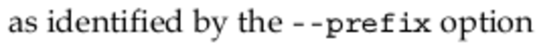

[./20170807-1503-cet-1-32.png](./20170807-1503-cet-1-32.png)

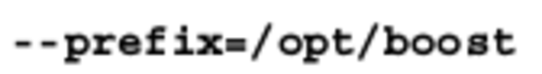

[./20170807-1503-cet-1-34.png](./20170807-1503-cet-1-34.png)

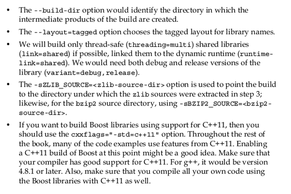

[./20170807-1503-cet-1-36.png](./20170807-1503-cet-1-36.png)

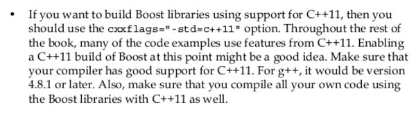

[./20170807-1503-cet-1-38.png](./20170807-1503-cet-1-38.png)

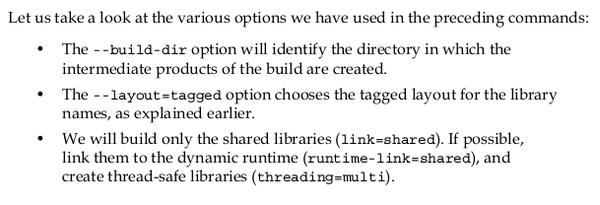

[./20170807-1503-cet-1-40.png](./20170807-1503-cet-1-40.png)

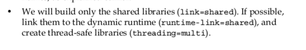

[./20170807-1503-cet-1-42.png](./20170807-1503-cet-1-42.png)

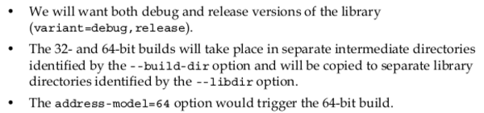

[./20170807-1503-cet-1-44.png](./20170807-1503-cet-1-44.png)

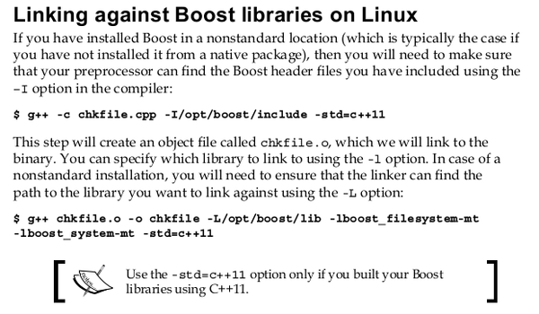

[./20170807-1503-cet-1-46.png](./20170807-1503-cet-1-46.png)

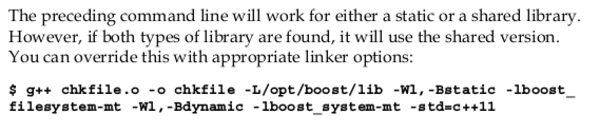

[./20170807-1503-cet-1-48.png](./20170807-1503-cet-1-48.png)

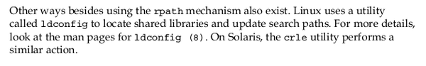

[./20170807-1503-cet-1-50.png](./20170807-1503-cet-1-50.png)

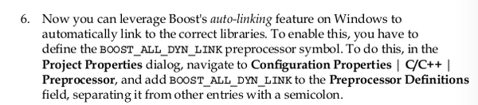

[./20170807-1503-cet-1-52.png](./20170807-1503-cet-1-52.png)

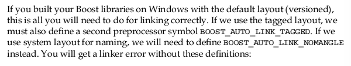

[./20170807-1503-cet-1-54.png](./20170807-1503-cet-1-54.png)

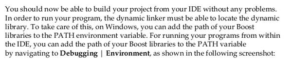

[./20170807-1503-cet-1-56.png](./20170807-1503-cet-1-56.png)

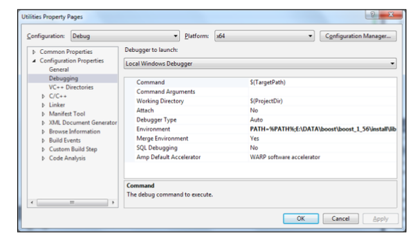

[./20170807-1503-cet-1-58.png](./20170807-1503-cet-1-58.png)

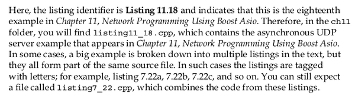

[./20170807-1503-cet-1-60.png](./20170807-1503-cet-1-60.png)

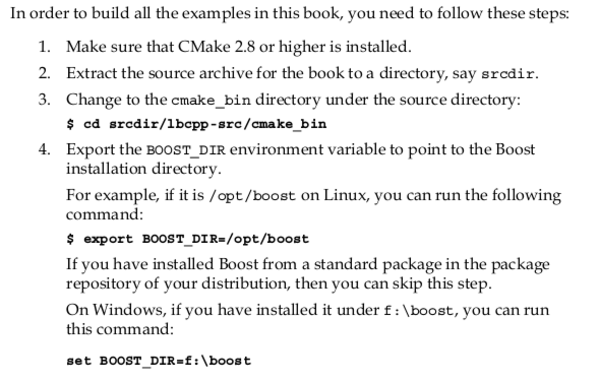

[./20170807-1503-cet-1-62.png](./20170807-1503-cet-1-62.png)

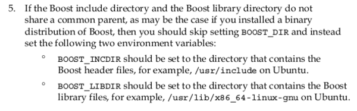

[./20170807-1503-cet-1-64.png](./20170807-1503-cet-1-64.png)

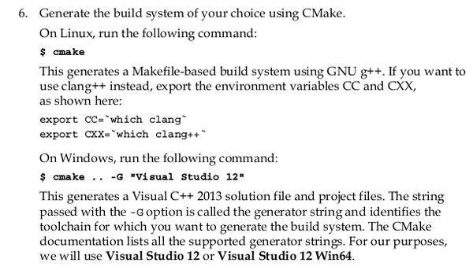

[./20170807-1503-cet-1-66.png](./20170807-1503-cet-1-66.png)

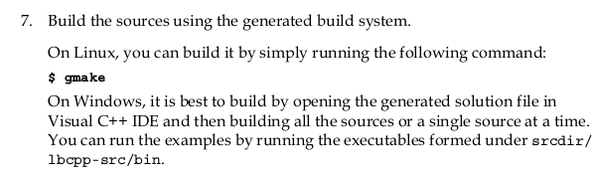

[./20170807-1503-cet-1-68.png](./20170807-1503-cet-1-68.png)

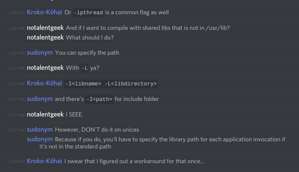

[./20170807-1503-cet-1-70.png](./20170807-1503-cet-1-70.png)