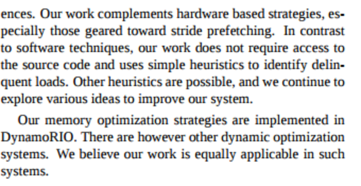

* Alright so, my Python script to initiate note fails.
* This note in particular has its images put not in order.
* So, while reading expect to understand image per image and not as it is the whole bullet points connected to each other.

* This paper is about making a state of the art memory manager.
* Usually when making memory manager, the programmer needs to have access to the source code.
* But the one that was made here is working as an external memory manager.
* I think this is like having two programs run at the same time. The first program is the main program itself, whereas the second program is this memory optimizer.
* There is also DynaoRIO, which is a run - time manipulation tool, [http://www.dynamorio.org/](http://www.dynamorio.org/).

* The thing here is to group object in run - time, based on the frequency of it being used. 

* The memory optimizer that this paper trying to make is called MO (as it is Memory Optimizer, lololol).
* DynamoRIO is used to manipulate things happen in run - time.
* For example for C++ `malloc()` and `calloc()` DynamoRIO wraps these functions into an allocation wrapper.
* The allocation wrapper also need another parameter which is the memory request monitor itself.
* The memory request monitor (MRM) is unique per call.
* MRM captures the memory allocation of the call.
* The current capture macthes with previous capture then MRM concluded to have valid content.

* Checking based on which MRM is "hot" (used frequenly more than other).

* Linked list is like a data structure with each elements has reference to previous and the next element in the list.

* The benefits, is to allocate/pooling memory based on its context.

* The design goals of this paper.
	* Completely automated and transparent.
	* Does not require access to source codes. This means that this MO is working independently to the program running.
	* Does not perform any run - time data migration.
	* Always preserve correctness.
	* Lightweight!

* The keypoint is to detect patterns, to determine context of each memory called and its call frequency.

* So does this sentence means that MO is built with DynamoRIO?

* I think this is the problem that can be further addressed in the next related research?
	* Pool allocation increase memory footprints of the applications. I suggest that increase in footprints is always negative.
	* Delay, because the object is never de - allocated the space is not released until the pool in empty.
	* Pool allocator might reserve more heap space (up to double the size).
		* Hmmm, heap size means memory allocation. So, is this means, that, I need to reserve 2 times the memory for this kind of operation?

* The key point from above screenshot is "patterns to exhibit more regularity".

* Data prefetching suggests that long latency cache misses dominated by only a small number of static loads.
* These loads are called delinquent loads. 
* This is the .pdf of this paper.

[./20170308-0141-cet-pool-allocation-and-prefetching-1-28.pdf](./20170308-0141-cet-pool-allocation-and-prefetching-1-28.pdf)