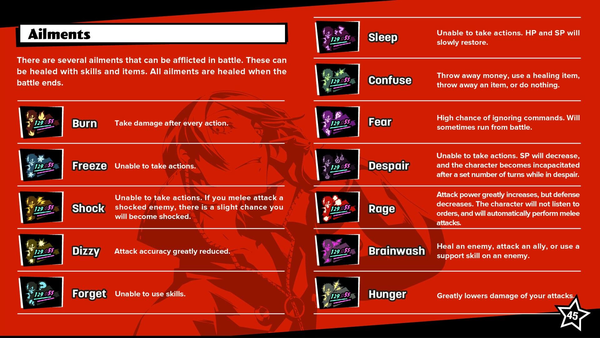

* Here are some Persona 5 guides I found from Reddit.

* This is about what kind of status ailments your character can get during the game.
* I only finished Persona Q so far. Panic in Persona 5 is named confusion.
* There are other elemental based ailments as well.

* In Persona 5 you get persona by interviewing the persona directly during the battle.
* This is more like usual Shin Megami Tensei game than how one could get persona from the previous Persona game.