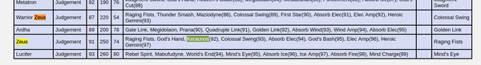

* I have finished the game.
* Cleared the last quest to kill The Reaper F.O.E.
* Cleared the final quest to attain Zeus.
* After the quest, it is said in the Velvet Room that I am supposed to be able to fuse Zeus.
* However, there is no option to fuse him.
* After I looked up here, [https://www.gamefaqs.com/3ds/739685-persona-q-shadow-of-the-labyrinth/faqs/70858#section59](https://www.gamefaqs.com/3ds/739685-persona-q-shadow-of-the-labyrinth/faqs/70858#section59). The Warrior Zeus Persona is on level 87.
* The Zeus itself is on level 91.
* I need to fuse Warrior Zeus first before fusing Zeus.

* There are some information in this forum post, [https://www.gamefaqs.com/boards/739685-persona-q-shadow-of-the-labyrinth/70715832](https://www.gamefaqs.com/boards/739685-persona-q-shadow-of-the-labyrinth/70715832).
    * To fuse Warrior Zeus I need these.
        * Metatron.
        * Michael.
        * Satan.
    * Michael and Satan already can be summoned through compendium.
* From this link, [https://www.gamefaqs.com/boards/739685-persona-q-shadow-of-the-labyrinth/70773342](https://www.gamefaqs.com/boards/739685-persona-q-shadow-of-the-labyrinth/70773342).
    * Metatron can be fused with these.
        * Ardha.
        * Satan.
    * Ardha is still missing.
* From this link, [https://www.gamefaqs.com/boards/739685-persona-q-shadow-of-the-labyrinth/70836923](https://www.gamefaqs.com/boards/739685-persona-q-shadow-of-the-labyrinth/70836923).
    * Ardha can be fused with these.
        * Shiva
        * Parvati.
    * Shiva can be fused with these.
        * Barong.
        * Rangda.
    * Shiva is at level 73.
* So, aside from level requirements. The Personas requirements for Warrior Zeus are these.
    * 2 Satans.
    * Ardha.
    * Barong.
    * Metatron.
    * Michael.
    * Parvati.
    * Rangda.
    * Shiva.
    * Shiva.
* Additionally, Seth is necessary to fuse Zeus.