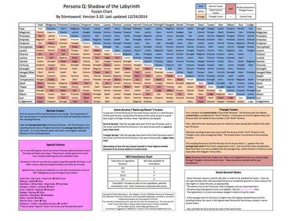

* This is Persona fusion table.
* The description on how it is working for the triangular fusion is quite hard to understand.
    * The most important thing is to look at the normal fusion table first.
    * Then compare the resultant to the triangular fusion table.
* Here is the link to the table, [https://www.gamefaqs.com/3ds/739685-persona-q-shadow-of-the-labyrinth/faqs/70843](https://www.gamefaqs.com/3ds/739685-persona-q-shadow-of-the-labyrinth/faqs/70843).
* Here is the table.

* Attachment.

[./20170409-0248-cet-persona-fusion-table-2.png](./20170409-0248-cet-persona-fusion-table-2.png)