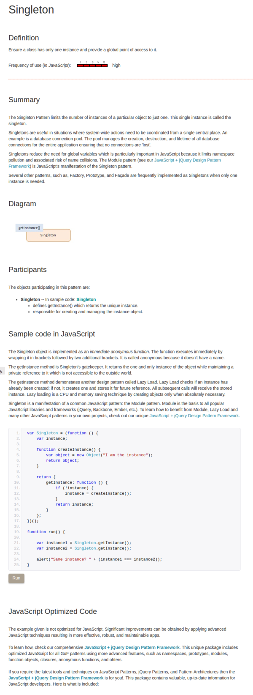

* Article on how to make singleton in JavaScript, [http://www.dofactory.com/javascript/singleton-design-pattern](http://www.dofactory.com/javascript/singleton-design-pattern).
* The article says that this implementation of singleton is no optimized and better code can be learned if the book promoted in the website bought.
* Singleton is used to restrict class instantiation to be only one object.
* Screenshot of the article.

[./20170807-1504-cet-singleton-2.png](./20170807-1504-cet-singleton-2.png)