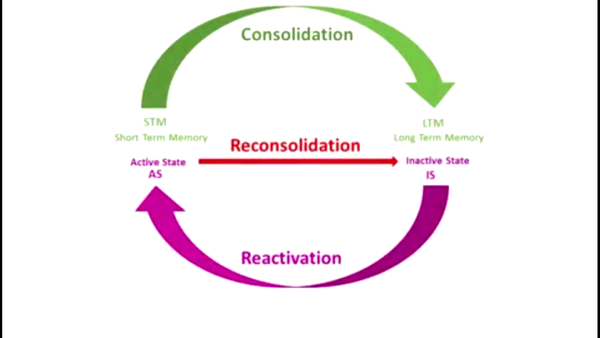
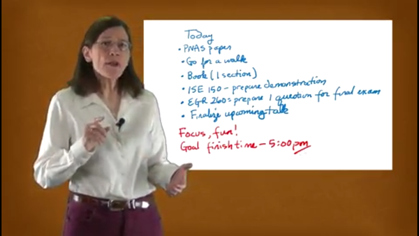
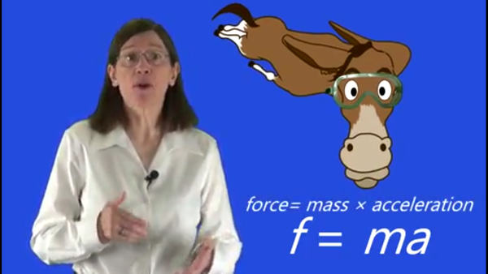
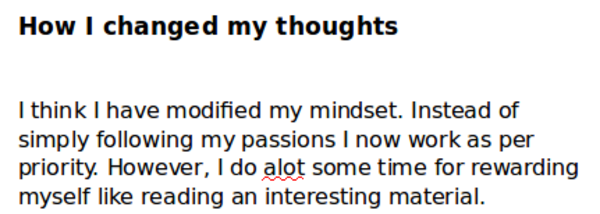

* Here are some screenshots I see still left in my pending folder.

[./20170712-1430-cet-22-2.png](./20170712-1430-cet-22-2.png)

* Flow between short term memory and long term memory.

[./20170712-1430-cet-22-4.png](./20170712-1430-cet-22-4.png)

* I forget for what purpose I took screenshot of this one. I supposed this a to - do list?

[./20170712-1430-cet-22-6.png](./20170712-1430-cet-22-6.png)

* Example of using imagination to remember things.
* The skydiving donkey represents what it is to remember.

[./20170712-1430-cet-22-8.png](./20170712-1430-cet-22-8.png)

* I got this excerpt from cross examining student works.
* This is very important! Passion does matter when working, but priority is!