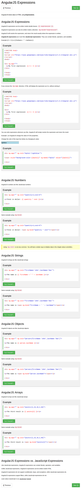
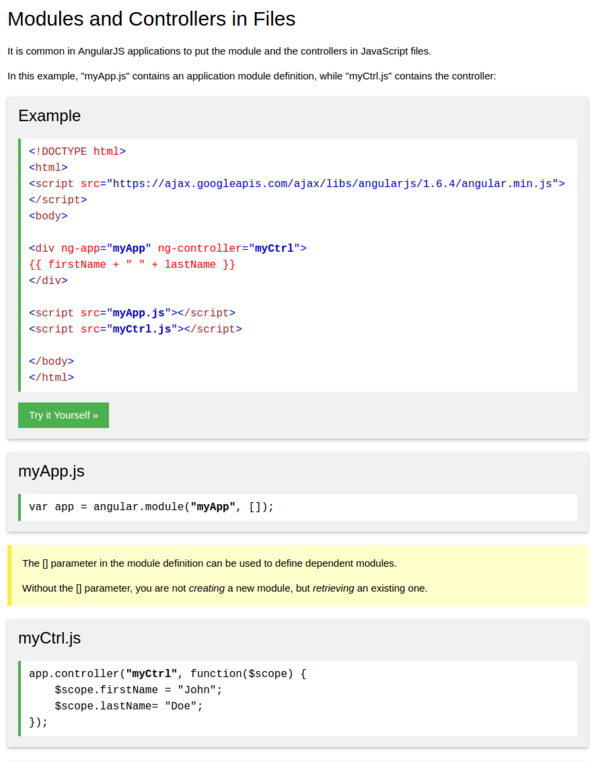
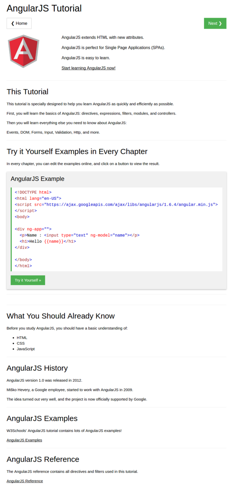
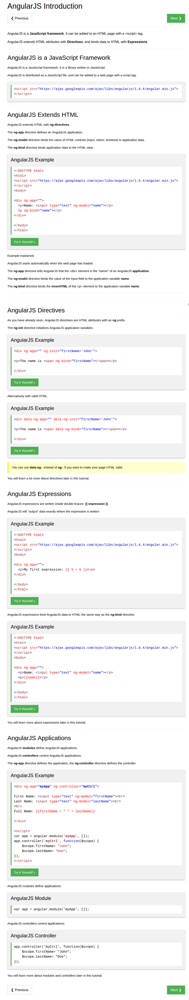
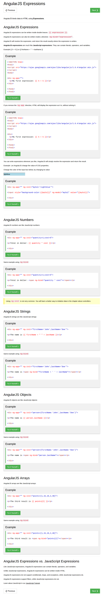

* When using Karma to test client - side codes, it is better to leave them as it is when changing codes. Hence, anomaly can be detected as soon as there is a change in the codes.
* There is this end - to - end test used in full stack web development. These tests are used to simulate user's input to the web application.
* In the example provided in [https://docs.angularjs.org/tutorial/](https://docs.angularjs.org/tutorial/), end - to - end codes can be ran with `npm run` and then in separate terminal run `npm run protractor`.
* I think, this end - to - end unit test is using `protractor` ([https://www.npmjs.com/package/protractor](https://www.npmjs.com/package/protractor)) `npm` package.
* This `protractor` E2E test has dependency to Selenium Standalone Server which needs Java JDK. However, I am not sure yet how the error looks like.
* What is `angular-seed`? `angular-seed` is a skeleton project of AngularJs. Perhaps, it used to kick - start the development of Angular based application.
* The first codes from the tutorial.

```markdown
<!doctype html>
<html lang="en" ng-app>
<head>
  <meta charset="utf-8">
  <title>my html file</title>
  <link rel="stylesheet" href="bower_components/bootstrap/dist/css/bootstrap.css" />
  <script src="bower_components/angular/angular.js"></script>
</head>
<body>
  <p>nothing here {{ "yet" + "!" }}</p>
</body>
</html>
```

* The `ng-app` in `<html lang="en" ng-app>` is a must. This is what determine a web page is an AngularJS based application. This also determine the root of application.
* I think I should attach the `<script src="bower_components/angular/angular.js"></script>` in the head instead of in the end of the `<body>`.
* If I put `<script src="bower_components/angular/angular.js"></script>` in the end of the `<body>` the DOM will get rendered first then Angular re-render back the web page. I think this could be the solution from my previous Toyota web project.
* As it is the same in Jinja 2 in Flask, `{{ ... }}` is used to evaluate expression. For example `{{ 1 + 2 }}` will display 3 in a designated DOM element.
* AngularJS model is not necessary unless it tied to a JavaScript codes.
* From the `ng-app`, it will automatically re - bind with AngularJS when the document loads.
* There are a lot of basic AngularJS functionalities come in as expressions. Here is W3Schools tutorial links about AngularJS expression, [https://www.w3schools.com/angular/angular_expressions.asp](https://www.w3schools.com/angular/angular_expressions.asp).
* Here is the screenshot of the tutorial.



[./20170807-1504-cet-1-2.png](./20170807-1504-cet-1-2.png)

* AngularJS module define an application. So, each application refers to a module.
* Inside that module there are several AngularJS controllers.
* Those controllers belong to the module.
* If there are some DOM elements that are preferred to be binded with AngularJS then put that DOM elements into a container and give it `ng-non-bindable` DOM properties.
* In practice it is common to have one JavaScript file for the AngularJS applications and other JavaScript file for AngularJS controllers. I got the information from this link, [https://www.w3schools.com/angular/angular_modules.asp](https://www.w3schools.com/angular/angular_modules.asp).
* Screenshot.



[./20170807-1504-cet-1-4.png](./20170807-1504-cet-1-4.png)

* AngularJS lets you extend HTML with new attributes called "directives".
* AngularJS has its own pre - made directives but the developer can easily make a custom ones as well.
* The `ng-model` directive is usually used to control HTML DOM that can induce controls to the users (button, input, ...).
* Everything that has been initiated with `ng-init` can be called in a control - flow (for example `<input>`) with `ng-model` that called the variable name.
* Using `ng-init` to declare variable is not very common! Usually in professional level the variable is declared within a `$scope` in a controlled mentioned in the script.
* Here is the difference between `<div>` and `<span>`.

```markdown
<!doctype>
<html>
<head>
  <script type="text/javascript" src="bower_components/angular/angular.js"></script>
</head>
<body ng-app="" ng-init="names=['hello','world','!'];">
  <div ng-repeat="i in names">{{ i }} </div>
</body>
</html>
```

* The codes above display these.

```markdown
hello
world
!
```

```markdown
<!doctype>
<html>
<head>
  <script type="text/javascript" src="bower_components/angular/angular.js"></script>
</head>
<body ng-app="" ng-init="names=['hello','world','!'];">
  <span ng-repeat="i in names">{{ i }}</span>
</body>
</html>
```

* The codes above display these.

```markdown
helloworld!
```

* Link for the tutorials from the W3Schools.
    * AngularJS Tutorial - home, [https://www.w3schools.com/angular/default.asp](https://www.w3schools.com/angular/default.asp).
    * AngularJS Introduction, [https://www.w3schools.com/angular/angular_intro.asp](https://www.w3schools.com/angular/angular_intro.asp).
    * AngularJS Expression, [https://www.w3schools.com/angular/angular_expressions.asp](https://www.w3schools.com/angular/angular_expressions.asp).
* These are each (respectively) the screenshot of the tutorials.



[./20170807-1504-cet-1-6.png](./20170807-1504-cet-1-6.png)



[./20170807-1504-cet-1-8.png](./20170807-1504-cet-1-8.png)



[./20170807-1504-cet-1-10.png](./20170807-1504-cet-1-10.png)