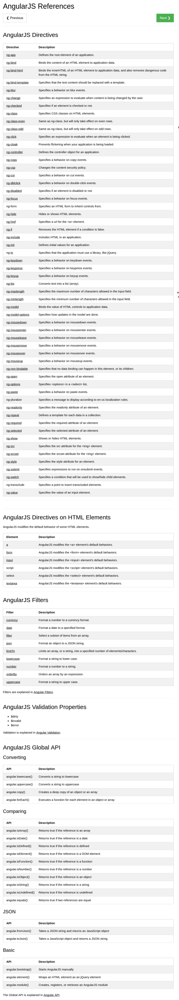
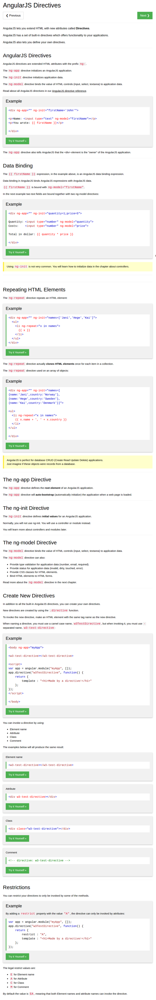

* AngularJS let you to extend new attributes with a mechanic so - called directives.
* Here is an example codes for `ng-app` and `ng-init` directives.

```markdown
<div ng-app="" ng-init="firstName='John'">
<p>Name: <input type="text" ng-model="firstName"></p>
<p>You wrote: {{ firstName }}</p>
</div>
```

* The `ng-app` directive tell the AngularJS that the corresponding `<div>` is the owner of the AngularJS application.
* The `{{ firstName }}` is an example of data binding.
* The `<div ng-app="" ng-init="firstName='John'">` tells the line that there is an AngularJS variable called `firstName` with its value of `John`.
* The `ng-model` is specifically used for input related HTML DOM (for example, in this case it is `<input>`).
* `<input type="text" ng-model="firstName">` means that the `<input>` will have the value filled with `firstName` variable.
* The value in `ng-model` will override the value of properties `value` (default to `<input>` DOM element).
* Here is an example codes that demonstrate the use of `ng-init` and `ng-model`.

```markdown
<div ng-app="" ng-init="price=5;quantity=1;">
Quantity: <input type="number" ng-model="quantity">
Cost    : <input type="number" ng-model="price">
</div>
Total   : {{ quantity*price }}
```

* The example above shows that data binding can be included with simple mathematics operation.
* There is `ng-repeat` as well to repeat HTML DOM elements. Below is the example codes.

```markdown
<div ng-app="" ng-init="names=['Jani','Hege','Kai']">
  <ul>
    <li ng-repeat="name in names">{{ name }}</li>
  </ul>
</div>
```

* The `names` is taken from `ng-init="names=['Jani','Hege','Kai']"`.
* `ng-repeat` can be used for any kind of array.

```markdown
<div ng-app="" ng-init="
names=[
  {name:'Jani',country:'Norway'},
  {name:'Hege',country:'Sweden'},
  {name:'Kai',country:'Denmark'}
];">
  <ul>
    <li ng-repeat="name in names">
      {{ name.name + ", " + name.country }}
    </li>
  </ul>
</div>
```

* The `ng-app` directive will automatically bootstrap the whole DOM elements listed as its child.
* The boostraping will happen as soon all DOM elements loaded.
* `ng-init` is used to define variable and to give initial value to the AngularJS application.
* `ng-model` is mainly used to control DOM related control element (check box, input, ...).
* However `ng-model` can be used for these things as well.
    * Bind HTML element to HTML form.
    * Provide CSS to specific HTML DOM element.
    * Provide status for application data.
    * Provide type validation.
* AngularJS lets its user to create their own directives.
* The self - made directive is made with `.directive()` function. Below is the example codes.

```markdown
<body ng-app="myApp">

  <test-directive></test-directive>

  <script>
    var a = angular.module("myApp", []);
    a.directive("test-directive", function () {
      return {
        template:"<h1>angularjs custom directive</h1>"
      }
    });
  </script>

</body>
```

* There are multiple way to invoke directive in AngularJS.
    * Using the element name.
    * Using attribute.
    * Using it as a class.
    * Using comment.
* Example codes using the element name.

```markdown
<test-directive></test-directive>
```

* Example codes using attributes.

```markdown
<div test-directive></div>
```

* Example codes using is as a class.

```markdown
<div class="test-directive"></div>
```

* Example codes using comment.

```markdown
<!-- directive:test-directive -->
```

* AngularJS let its user to restrict the method on how to invoke directive.
* For an example the codes below only let the directive to be invoked as an attribute.

```markdown
var a = angular.module("myApp", []);
a.directive("test-directive", function () {
  return {
    restrict:"A",
    template:"<h1>angularjs custom directive</h1>"
  };
});
```

* The `"A"` refer to attribute.
* There are these options as well.
    * `"A"` let the directive can only be invoked by attribute.
    * `"C"` let the directive can only be invoked by class.
    * `"E"` let the directive can only be invoked by element name (DOM/HTML tag).
    * `"M"` let the directive can only be invoked by comment.
* You can use `restrict:"AC"` for both only invoked by attribute and only invoked by class (multiple allowance). Referenced from, [https://stackoverflow.com/questions/23220976/angularjs-directive-restrict-a-vs-e](https://stackoverflow.com/questions/23220976/angularjs-directive-restrict-a-vs-e).
* Here are some AngularJS API references (mostly API).



[./20170816-2007-cet-2-2.png](./20170816-2007-cet-2-2.png)

* Here is the link to the W3Schools tutorial about AngularJS Directives, [https://www.w3schools.com/angular/angular_directives.asp](https://www.w3schools.com/angular/angular_directives.asp).
* Here is the full screenshot of the tutorial.



[./20170816-2007-cet-2-4.png](./20170816-2007-cet-2-4.png)

* In the end it is better to start everything with plan then executed it through trial and error (plus asking proper questions online).