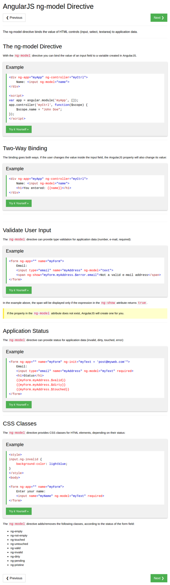

* The `ng-model` directive binds the value of HTML input control (for example: input, select, text area, ...).
* This is an example usage for `ng-model` where `ng-init` is not involved.
* This directive binding works both ways. If the front end change the designated `$scope` variable will also be changed in real - time.

```markdown
<div ng-app="myApp" ng-controller="myCtrl">
  Name : <input ng-model="name">
  You entered {{ name }}.
</div>
<script>
  var a = angular.module("myApp", []);
  a.controller("myCtrl", function ($scope) {
    $scope.name = "John Doe";
  });
</script>
```

* There is also built - in `$error` (in addition of `$scope`) that is used to handled pre - determined input error.
* The example below is how to use `$error` to check the validity of an input string if it is a valid email format.

```markdown
<!doctype>
<html>
  <body>
    <form ng-app="" name="myForm">
      <input type="email" name="myAddress" ng-model="text">
      <!-- The `<span>` below will only be shown when the mentioned error happens. -->
      <span ng-show="myForm.myAddress.$error.email">Text inputted is not a valid email address.</span>
    </form>
    <p>
      Enter your email address in the input field. AngularJS will display an error message if the address is not an email.
    </p>
  </body>
</html>
```

* The AngularJS has 3 methods know the status of HTML input element with the use of these 3 AngularJS variables.
    * `$dirty` if the input value has been changed once.
    * `$touched` if the HTML DOM element has been touched (active) once.
    * `$valid` is the contrary to `$error`.
* Here is the example codes that demonstrate the usage of these internal AngularJS variables.

```markdown
<!doctype html>
<html>
  <body>
  <form ng-app="myApp" name="myForm" ng-init="myText='post@myweb.com'">
    <input type="email" name="myAddress" ng-model="myText" required>
    <p>
      Valid: {{ myForm.myAddress.$valid }} (if true, the current value meets all the requirements)
    </p>
    <p>
      Dirty: {{ myForm.myAddress.$dirty }} (if true, the value has been changed)
    </p>
    <p>
      Touched: {{ myForm.myAddress.$touched }} (if true, the field has been in focus)
    </p>
  </form>
  </body>
</html>
```

* The `required` protocol came in as a part of HTML5. Within the form if the `required` field has no proper value the submit button will not pass through.

```markdown
<html>
  <head>
    <style>
      input.ng-invalid { background-color: red; }
    </style>
  </head>
  <body>
    <form ng-app="" name="myForm">
        Name: <input name="myName" ng-model="myText" required>
    </form>
    <p>
      Edit the text field and it will get/lose classes according to the status.
    </p>
    <p>
      <strong>Note:</strong> A text field with the `required` attribute is not valid when it is empty.
    </p>
  </body>
</html>
```

* These are the AngularJS CSS directive that is ready to be used.
    * `ng-dirty`.
    * `ng-pristine` is the opposite of `ng-dirty`.
    * `ng-empty`.
    * `ng-not-empty`.
    * `ng-touched`.
    * `ng-not-touched`.
    * `ng-valid`.
    * `ng-invalid`.
    * `ng-pending` is used for asynchronous HTTP request or anything that require waiting to retrieve data.
* This whole note is a summarization from this web page, [https://www.w3schools.com/angular/angular_model.asp](https://www.w3schools.com/angular/angular_model.asp).
* The codes in this note are not checked, hence it is better to check back with the original source.
* Here is the screenshot of the W3Schools tutorial about AngularJS Model.



[./20170816-2007-cet-3-2.png](./20170816-2007-cet-3-2.png)

* In the end it is better to start everything with plan then executed it through trial and error (plus asking proper questions online).