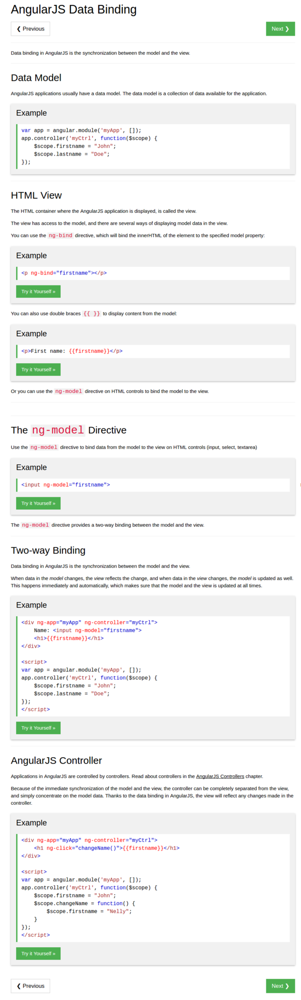

* AngularJS application usually has a data model.
* Data model is a collection of data that is available to be used within the application.
* The codes below is a simple example of AngularJS data model.

```markdown
<html>
  <head>
    <script>
      var a = angular.module("myApp", []);
      app.controller("myCtrl", function ($scope) {
        $scope.firstName = "John";
        $scope.lastName = "Doe";
      });
    </script>
  </head>
</html>
```

* The codes below is the example of AngularJS data model.
* And then there is a HTML view. The codes below is an example of HTML view.

```markdown
<div ng-app="myApp" ng-controller="myCtrl">
  <p ng-bind="firstName"></p>
</div>
```

* Or as simple and as most people usually use like these codes below.

```markdown
<div ng-app="myApp" ng-controller="myCtrl">
  <p>{{ firstName }}</p>
</div>
```

* HTML view is where the AngularJS application is rendered.
* Since JavaScript is very liberal on what could be in a variable. Codes like below is an alternative way to get into click event function.

```markdown
<!doctype html>
<html>
  <body>
    <div ng-app="myApp" ng-controller="myCtrl">
      <h1 ng-click="changeName()">{{ firstName }}</h1>
    </div>
    <script>
      var a = angular.module("myApp", []);
      a.controller("myCtrl", function ($scope) {
        $scope.firstName = "John";
        $scope.changeName = function () {
            $scope.firstName = "Nelly";
        };
      });
    </script>
  </body>
</html>
```

* This whole note is a summarization from this web page, [https://www.w3schools.com/angular/angular_databinding.asp](https://www.w3schools.com/angular/angular_databinding.asp).
* The codes in this note are not checked, hence it is better to check back with the original source.
* Here is the screenshot of the W3Schools tutorial about AngularJS Model.



[./20170816-2007-cet-4-2.png](./20170816-2007-cet-4-2.png)

* In the end it is better to start everything with plan then executed it through trial and error (plus asking proper questions online).