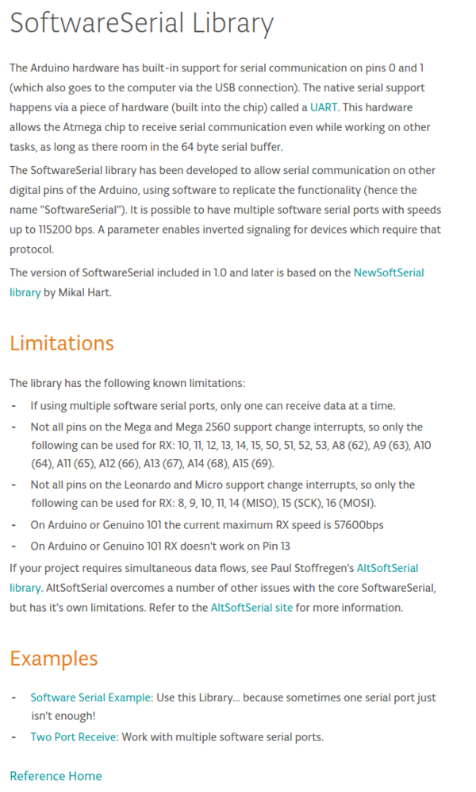

* SoftwareSerial is a method to replicate serial communication in Arduino digital pins.
* Here is the official information page from the Arduino itself, [https://www.arduino.cc/en/Reference/softwareSerial](https://www.arduino.cc/en/Reference/softwareSerial).
* Here is the full screenshot of the tutorial.

