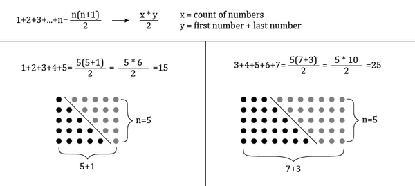
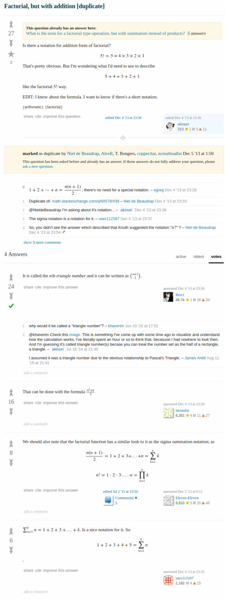

* I asked a stupid question, asking about is there any specific notation for factorial but with addition.
* I forgot either at which part this formula make sense to this project.
* Here is the discussion link, [http://math.stackexchange.com/questions/593318/factorial-but-with-addition/593320](http://math.stackexchange.com/questions/593318/factorial-but-with-addition/593320).
* At simplest I can still use sigma notation.
* At any case there is this formula to calculate the sum of the numbers in the patters, `(n(n + 1))/2`.
* This is a theory about nth triangle number.

* Explanation about nth triangle number.
* Here is the full screenshot.

