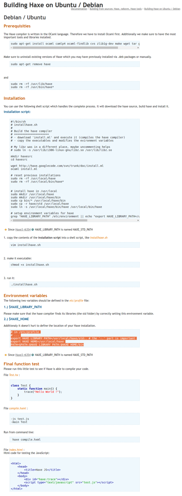

* There is this old tutorial from old HaXe website.
* This tutorial is for compiling HaXe in Debian based distro.
* From this page, I know that HaXe compiler is made in OCaml language.
* However, from this tutorial, I only need to know how to set up proper environment variables.
* I think environment variables are cross platform through all major desktop operating system like Linux, MacOs, and Windows.
* There are 3 environment variables those I need to set.
* 2 of them are new environment variables that I need to create by myself.
* The first environment variable I need to set up for HaXe is `HAXE_LIBRARY_PATH` which leads to HaXe's `std` folder.
* The second environment variable I need to set up for HaXe is `HAXE_HOME` which leads to HaXe main folder.
* The third environment is the default `PATH`. This variable should be exists by default by any desktop operating system.
* This `PATH` variable needs to point back to itself as well as point to `HAXE_LIBRARY_PATH` and to `HAXE_HOME/bin`.
* Here is the example Shell script for setting the environment variables.

```markdown
# in /etc/profile
# ...
export HAXE_LIBRARY_PATH=/usr/local/haxe/std:. # the ':.' part is important
export HAXE_HOME=/usr/local/haxe
PATH=$PATH:$HAXE_LIBRARY_PATH:$HAXE_HOME/bin
```

* Here is the link to the tutorial, [http://old.haxe.org/doc/build/haxe_ubuntu_build](http://old.haxe.org/doc/build/haxe_ubuntu_build).
* Here is the full screenshot of the webpage.

