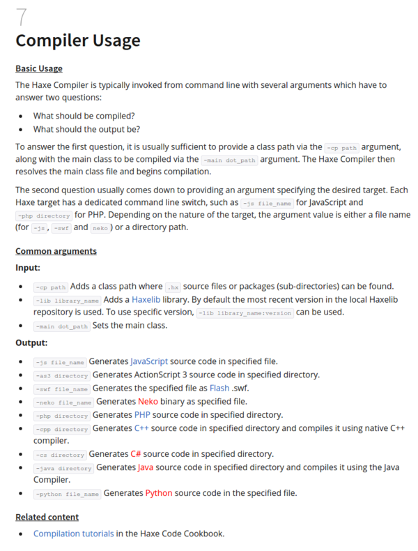

* There is this HaXe manual for compiling.
* This guide shows you on how to compile HaXe codes.
* As you can see HaXe is used to compile .hx files into programming language of your choice.
* Here is the link to the website, [http://haxe.org/manual/compiler-usage.html](http://haxe.org/manual/compiler-usage.html).
* Here is the full screenshot of the guide.

