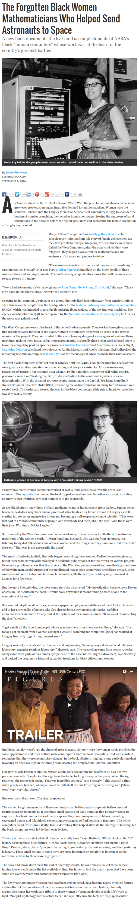

* An article about an African - American mathematician woman that helped NASA go to outer space, [http://www.smithsonianmag.com/history/forgotten-black-women-mathematicians-who-helped-win-wars-and-send-astronauts-space-180960393/?no-ist](http://www.smithsonianmag.com/history/forgotten-black-women-mathematicians-who-helped-win-wars-and-send-astronauts-space-180960393/?no-ist).
* Full screenshot of the tutorial.

