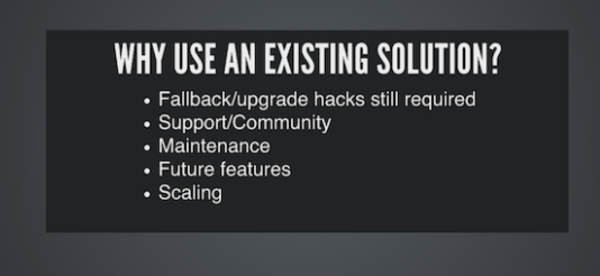

* There is this article about choosing technology.
* I think this part is relevant to my bachelor thesis in term of choosing the right technologies.

* This article is about choosing the right framework for real time web application in general.
* However, need to be mentioned that this article was from 2013. During that time until the time this note written there are a lot of things changed in JavaScript.
* Here is the link to the article, [https://www.leggetter.co.uk/2013/12/09/choosing-realtime-web-app-tech-stack.html](https://www.leggetter.co.uk/2013/12/09/choosing-realtime-web-app-tech-stack.html).
* Screenshot.

